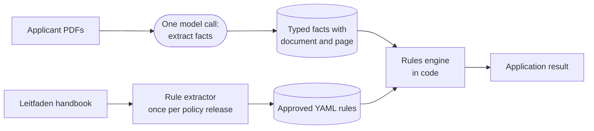

# Automatic admissions screening

A case study for IU. Staff read the documents for every study application by hand and decide
academic access against a 93,500-token policy handbook. This repository screens an application
automatically and produces a result a caseworker can audit.

A model reads the applicant's PDFs and returns typed facts. A deterministic rules engine reads
those facts and decides. The model never sees the policy and never decides eligibility.



Three other architectures were built and measured on the same applicants. The rules engine was
the most accurate, it was the only one that returned the same answer on a repeat run, and it was
the only one that never admitted an applicant who does not qualify. The comparison is in
[alternate-options/](alternate-options/).

## Start here

| If you have | Read |
| --- | --- |
| 5 minutes | This file, then the matrix in [alternate-options/README.md](alternate-options/README.md) |
| 20 minutes | [docs/technical-design-document.md](docs/technical-design-document.md), sections 1, 3, and 4 |
| Longer | The code, starting at [app/services/screening.py](app/services/screening.py) |

## Layout

| Path | What it is |
| --- | --- |
| [app/](app/) | The service. CLI, facts extraction, rules engine |
| [rules/](rules/) | The approved policy as versioned YAML, `IU_BACHELOR_ACCESS` 0.0.22 |
| [test/](test/) | 98 offline tests, including 15 gold policy scenarios |
| [evals/](evals/) | How accuracy is measured, and the LLM judges |
| [samples/](samples/) | 27 synthetic applicant bundles and the blank templates behind them |
| [alternate-options/](alternate-options/) | The three other architectures, with their run evidence |
| [tools/](tools/) | Rule drafting from the handbook, and the sample builder |
| [docs/](docs/) | The technical design document, the glossary, and the measured evidence |
| [case-study/](case-study/) | The IU policy handbook, as supplied. Their property |

## Run it

Python 3.12 and [uv](https://docs.astral.sh/uv/).

```console
uv sync --all-groups
cp .env.example .env        # then add OPENAI_API_KEY
```

That is everything. The policy handbook that the alternate options and the rule extractor read
is in [case-study/](case-study/).

Screen one applicant. Extraction and evaluation run in one command, and the facts are saved and
reloaded before evaluation, so the decision always runs on the exact bytes that were written.

```console
uv run admissions screen \
  samples/filled-documents/daniel-roth/ihk-zeugnis.pdf \
  samples/filled-documents/daniel-roth/ba-arbeitsbescheinigung.pdf \
  --program BACHELOR \
  --output-dir runs/daniel-roth
```

Replay a saved result with no model call and no API key. The rules engine and the facts file are
the only inputs, so a re-run returns the same result.

```console
uv run admissions evaluate \
  --facts runs/daniel-roth/application-facts.json \
  --output runs/daniel-roth/application-result.json
```

`extract` runs the model call on its own. `--trace` sends the run to LangSmith and needs
`LANGSMITH_API_KEY`. `ADMISSIONS_OPENAI_MODEL` sets the model for the service and for every
alternative in this repository. Each option, and the LLM judges, trace to their own LangSmith
project — see the `LANGSMITH_PROJECT` overrides in `.env.example`.

## Verify it

The test suite is offline. It calls neither OpenAI nor LangSmith.

```console
uv run pytest -q          # 98 tests
uv run ruff check app test evals
uv run mypy
```

## What it does not do

It screens academic access only. Identity, document authenticity, fraud, fees, and health
insurance are out of scope, and so is any integration with Salesforce or EPOS. One program is
configured, `BACHELOR`, with five rules. Anything the rules cannot express returns
`MANUAL_REVIEW` rather than a guess.

Facts carry one of four evidence states, which are `KNOWN`, `MISSING`, `UNREADABLE`, and
`CONFLICTING`. A known false value is not the same as a missing one, so a fact the model failed
to find asks the applicant for a document instead of rejecting them.
