# IU Case Study - Automatic Admissions

## 1. Introduction

### 1.1 Problem and motivation

IU staff review the documents for each study application by hand to determine academic access and record the supporting details.
IU handles about 50,000 new students each year, and more than 10,000 students may start on one day. Each review can involve several documents and rules that vary by program, qualification, country, and subject. Staff must also distinguish missing, unreadable, and conflicting information because each state may require a different action.
IU needs to reduce this manual work and processing time without weakening accuracy, auditability, or regulatory compliance.

### 1.2 Goals

The goal is to reduce the manual work required for academic access screening by producing a structured and auditable report for each application. The report will state the final academic access outcome, record missing, unreadable, or conflicting information, and link each finding to the cited document evidence and policy version used.
The service may issue an ELIGIBLE report without caseworker review when the evidence fully supports the outcome. Reports with any other outcome require human handling. The service must meet the accuracy, compliance, and auditability requirements in Section 2 before release.

### 1.3 Non-goals

The following work is also outside the scope of this TDD:-

- Assesment of identity, document authenticity, fraud, language requirements, fees, health insurance.
- Direct integration with Salesforce, EPOS, or applicant communication systems. Other systems may consume the screening report later, but their APIs, field mappings, and workflows are not defined here.
- Applications outside the approved programs must receive a manual review outcome.
- A custom interface for applicants or caseworkers. The service produces the screening report only.

### 1.4 Stakeholders

| Stakeholder                | Role            | What they own or decide                                                                                   |
| -------------------------- | --------------- | --------------------------------------------------------------------------------------------------------- |
| Admissions Automation team | Technical owner | Design, build, test, release, and operate the service                                                     |
| Admissions caseworkers     | Human reviewers | Review referred cases, correct errors, and record approved overrides                                      |
| Admissions operations      | Business owner  | Define the screening process, approve the level of automation, and accept the service for operational use |

### 1.5 Definitions

| Term               | Definition                                                                                                                                          |
| ------------------ | --------------------------------------------------------------------------------------------------------------------------------------------------- |
| Application        | A request by one applicant for one selected admission program. The service assesses each application separately.                                    |
| Admission program  | The configured program selected for an application.                                                                                                 |
| Admissions rule    | An approved set of requirements that may establish eligibility for the selected admission program.                                                  |
| Application fact   | A structured value or unknown state extracted from the submitted documents.                                                                         |
| Evidence state     | The state of an application fact: `KNOWN`, `MISSING`, `UNREADABLE`, or `CONFLICTING`. A known false value is different from a missing value.        |
| Evidence reference | A document, page, and excerpt cited for an application fact. It is a reported source location and does not prove that the source supports the fact. |
| Application result | The result produced after all applicable admissions rules have been evaluated. It contains the final outcome defined by the existing outcome enum.  |

---

## 2. Requirements

### 2.1 Functional (F)

| ID  | Requirement                                                                                                                                                                                                                                                                                             | Priority |
| --- | ------------------------------------------------------------------------------------------------------------------------------------------------------------------------------------------------------------------------------------------------------------------------------------------------------- | -------- |
| F1  | The service must accept and process one or more complete application bundles in a single batch. Each bundle must contain a configured admission program and its PDF documents.                                                                                                                          | Must     |
| F2  | The service must validate each application bundle separately. Invalid programs, encrypted documents, malformed documents, and processing failures must return a technical error rather than an application outcome. A failure in one application must not stop the remaining applications in the batch. | Must     |
| F4  | The service must save the extracted facts as a versioned internal record and produce a separate application result report for each application.                                                                                                                                                         | Must     |
| F7  | The service must preserve every required admission condition in a `CONDITIONALLY_ELIGIBLE` result. It must not report a conditional result as `ELIGIBLE`.                                                                                                                                               | Must     |
| F8  | The service must return `MISSING_INFORMATION` when additional applicant evidence can resolve a required missing or unreadable fact.                                                                                                                                                                     | Must     |
| F9  | The service must return `MANUAL_REVIEW` when the admission program is valid but the qualification, evidence, or policy interpretation is unsupported, conflicting, or unclear.                                                                                                                          | Must     |
|     |
| F10 | Every fact used to support an `ELIGIBLE` result must include a valid document and page reference. A missing or invalid reference must prevent automatic eligibility.                                                                                                                                    | Must     |
| F11 | Each batch must have a batch ID, and each application in the batch must have its own run ID. Each facts record and result report must include the run ID, document hashes, admission program, policy version, schema version, and extraction versions used.                                             | Must     |
| F12 | The service should support replaying rule evaluation from a compatible saved facts record without extracting the documents again.                                                                                                                                                                       | Could    |

### 2.2 Performance and scale (P)

| ID  | Requirement              | Target | How measured                                                                              |
| --- | ------------------------ | ------ | ----------------------------------------------------------------------------------------- |
| P1  | Latency at p95           | Open   | Wall clock per application, measured end to end. The prototype runs at about 16 s         |
| P2  | Throughput / volume      | Open   | Applications per hour. Bounded by the model provider's rate limit, which is not yet known |
| P3  | Accuracy / quality floor | Open   | Share of applications matching the expected status, and the share wrongly called ELIGIBLE |

Targets are open. The measurement method for each one is settled and the prototype numbers are
in section 4.2, so a target is a business decision rather than a missing capability. P3 in
particular cannot be set until the false eligible rate is measured on real applications, which
is the condition D3 puts on autonomy.

### 2.3 Security and compliance (S)

| ID  | Requirement                                                                                                                                                                      |
| --- | -------------------------------------------------------------------------------------------------------------------------------------------------------------------------------- |
| S1  | Open. Applicant documents are personal data, so a PII and retention design is required before any real application is processed. The prototype runs on synthetic applicants only |

---

## 3. Architecture

### 3.1 Current state

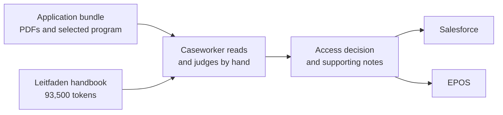

A caseworker reads the documents, applies the handbook, and keys the decision into Salesforce
and EPOS by hand. There is no machine record of which rule or which page supported the
decision.

### 3.2 Proposed state

Solid boxes are built. Dashed boxes are designed and not built.

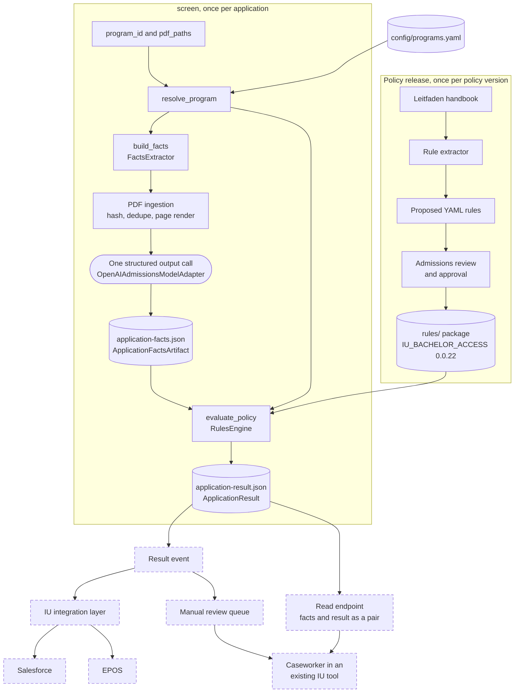

The policy is turned into rules once per release and approved by a person, so no model reads
the handbook at screening time. Per application, `resolve_program` turns the program ID into a
trusted `ProgramContext`, the facts extractor ingests the PDFs and makes one structured output
call, the facts are saved, and the rules engine evaluates the saved facts. The program context
travels inside the saved artifact, and the rules engine picks its policy from
`artifact.program.policy.id`, so evaluation needs no configuration of its own.

**Manual review queue.** The service publishes one result event per application. A queue holds
every event whose status is not `ELIGIBLE`, and caseworkers work that queue in a tool IU
already runs, because a custom caseworker interface is a non-goal. The queue is not built.

### 3.3 Data flow

#### Main path, the `screen` command

Node names are the LangGraph node names in `_compile_screen_graph`.

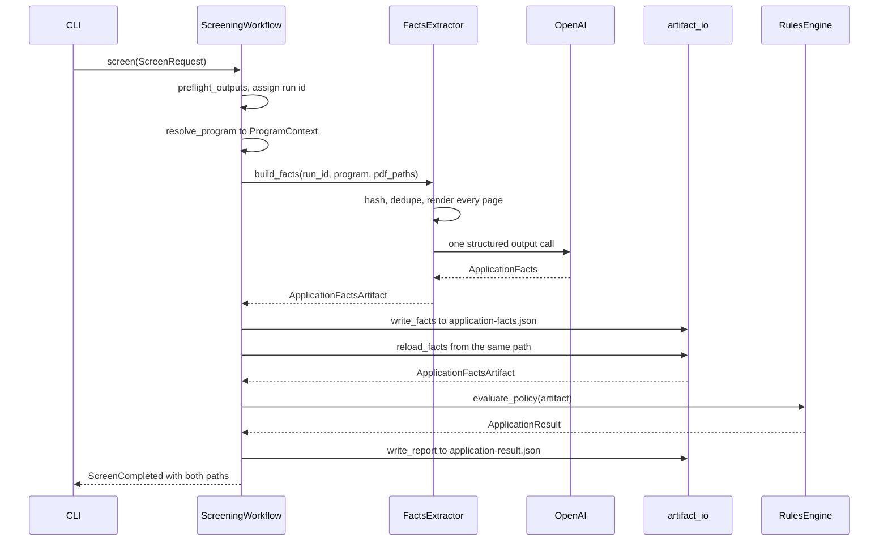

`screen` writes the facts and then reads them back before evaluating, so evaluation always
runs on the exact bytes that were saved.

#### Replay path, the `evaluate` command

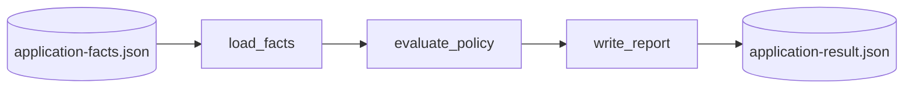

`evaluate` runs the same rules engine on a saved facts file with no model call, which is what
F12 asks for. Only the rules engine and the facts file decide the result, so a re-run returns
the same result.

#### Failure path

There is one retry in the whole system, and it sits inside the facts extractor.

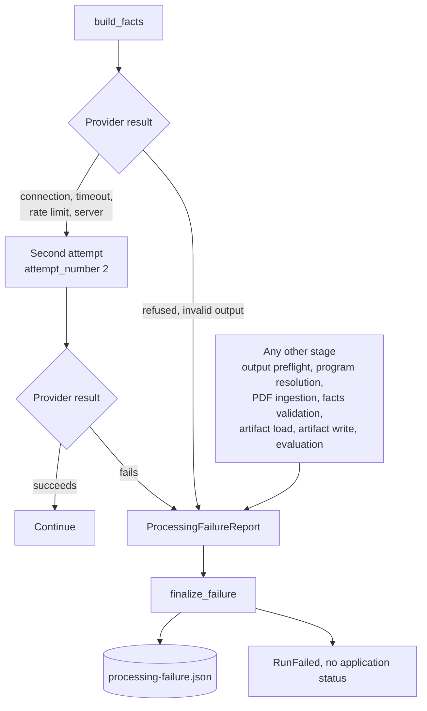

Every failure produces a `ProcessingFailureReport` with a stage from `FailureStage`, a stable
code, and a safe message, so a broken run is never mistaken for a decision. The OpenAI client
is built with `max_retries=0`, so the single retry in the extractor is the only one. Each
application carries its own run ID and its own output directory, so one failure does not
affect another application, which is what F2 asks for.

Common codes, with the stage each one belongs to.

| Stage                | Code                                                            | Cause                                                         |
| -------------------- | --------------------------------------------------------------- | ------------------------------------------------------------- |
| `OUTPUT_PREFLIGHT`   | `OUTPUT_OVERLAPS_INPUT`                                         | An output path would overwrite the input facts file           |
| `PROGRAM_RESOLUTION` | `PROGRAM_NOT_CONFIGURED`                                        | The program ID is not in the catalog                          |
| `PDF_INGESTION`      | `ENCRYPTED_PDF`, `CORRUPT_PDF`, `NOT_PDF`, `PAGE_RENDER_FAILED` | A file cannot be read                                         |
| `PDF_INGESTION`      | `BATCH_LIMIT_EXCEEDED`                                          | Over 10 unique PDFs, 100 pages, or 50 MB                      |
| `EXTRACTION`         | `EXTRACTION_INVALID_OUTPUT`, provider error codes               | The model call did not return valid facts                     |
| `FACTS_VALIDATION`   | `INVALID_EVIDENCE_REFERENCE`                                    | A cited document or page is not in the manifest               |
| `EVALUATION`         | `POLICY_NOT_ACTIVATED`                                          | The saved facts name a policy this deployment did not compile |

### 3.4 How a batch is processed

F1 asks the service to accept one or more bundles in a single batch. The CLI screens one bundle per invocation, The options below keep the per application unit of work unchanged..

| Option | Summary                                                                                        | Pros                                                                                                                             | Cons                                                                                                  | Cost   |
| ------ | ---------------------------------------------------------------------------------------------- | -------------------------------------------------------------------------------------------------------------------------------- | ----------------------------------------------------------------------------------------------------- | ------ |
| A      | A batch runner starts N `admissions screen` processes in parallel and collects the outcomes.   | Nothing new inside the service. Process isolation is total, so a crash cannot take another application down.                     | Concurrency is capped by one machine. No retry of a whole run. The batch ID lives only in the runner. | Low    |
| B      | The service accepts a batch request and runs the applications concurrently inside one process. | One entry point, one batch ID, one place to hold the provider rate limit.                                                        | A single process is a single failure point for the whole batch. Scaling means a bigger machine.       | Medium |
| C      | A batch is expanded into one queue message per application, and a pool of workers consumes it. | Scales horizontally, which is what 10,000 applications on one day needs. Retry, backoff, and dead lettering come from the queue. | Needs queue infrastructure and a worker deployment. Results are eventually consistent.                | Medium |

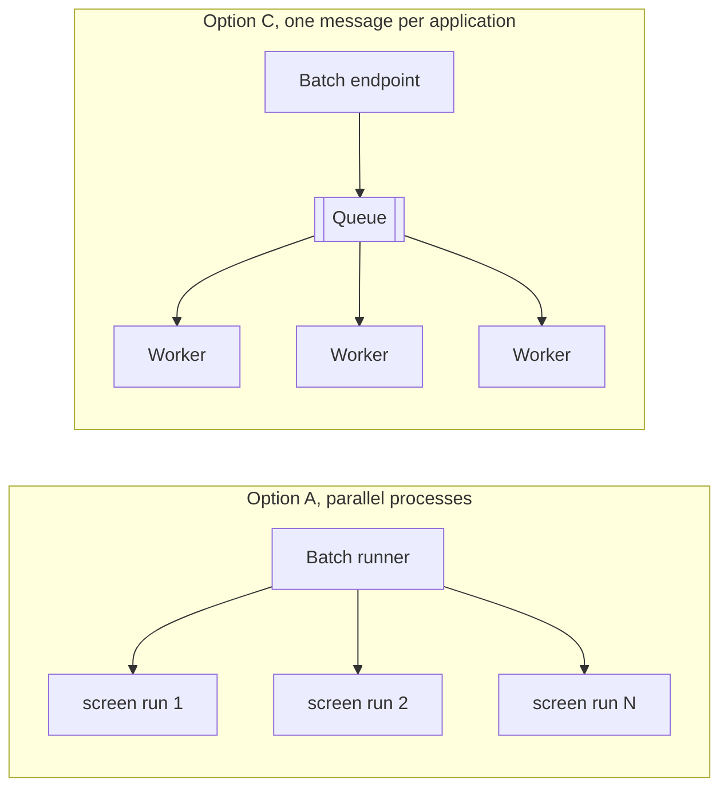

**Proposed.** Option A now, because it needs no service change and it is enough to run the
prototype over a labeled set. Option C for production, because the daily peak is roughly
10,000 applications and the binding limit is the model provider's rate limit rather than the
rules engine.

**Trade-off accepted.** Option A gives up horizontal scale and automatic retry. The batch ID
sits in the runner rather than in a stored record until Option C lands, so F11's batch ID is
only partly met today.

**Open item.** The model provider's rate limit per minute is not known, and it sets the
real throughput ceiling.

---

## 4. Design

### 4.1 Design decisions

Decisions are ordered by impact. D1 sets what the system is, and D2 sets how it is measured.
D3 sets how much of the caseworker's job it takes. D4 and D5 set the contracts everything
else is built on. D6 to D8 are consequential but reversible without redesigning the service.

Each block states the options that were considered, the option that was chosen, and the
trade-off accepted by choosing it. A decision earns a block when reversing it would change
the system's contract, its cost, or its risk profile.

#### D1: How the admissions policy gets applied

**Context.** The policy lives in a 93,500-token handbook, the Leitfaden. An application
arrives as a bundle of PDFs. Something has to read the policy, read the documents, and
produce a status. Where that work sits is the decision the rest of the design hangs off.
Four architectures were built or specified and compared on the same 27 synthetic personas,
the same five-value status vocabulary, and the same labeled subsets described in section 4.2.

**ApplicationResult**

- ELIGIBLE
- CONDITIONALLY_ELIGIBLE
- INELIGIBLE
- MISSING_INFORMATION
- MANUAL_REVIEW

**Option A: extraction into typed facts, then a compiled rules engine**

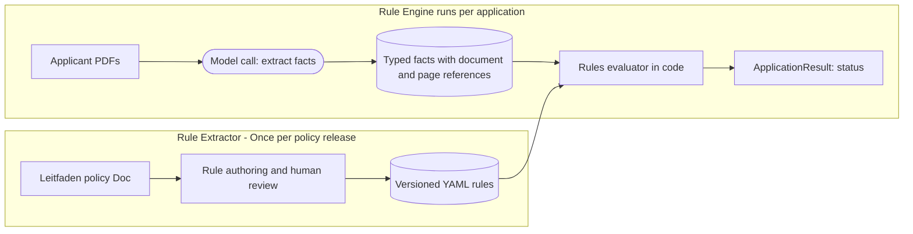

The policy is turned into rules once, by the `Rule Extractor`, and released like any other code change after human review.
Per application the `Rule Engine` reads only the applicant's documents, and decides the `Application Result`.
The model never sees the policy.

**Pros**

1. **Reliability and Repeatability:** the same bundle always produces the same status, because code makes
   the decision. Across three repeats of 16 personas, no answer changed.
2. **Traceability:** every status resolves to a named rule, the facts that rule read, and
   the page each fact came from.
3. **Running cost:** the policy is never sent to the model, so the cost of an application
   depends only on the size of the applicant's bundle.

**Cons**

1. **Coverage:** a rule the DSL cannot express cannot run at all, so the cases it would have
   decided fall to MANUAL_REVIEW.
2. **Maintenance:** rules have to be written and reviewed for each program, which is
   engineering work rather than a prompt edit.
3. **Recall cap:** a fact the model does not find becomes MISSING, so accuracy is limited by
   extraction rather than by the rules.

**Cost and effort.** High to build, low to run.

**Option B: full policy workflow, two agents over the whole handbook**

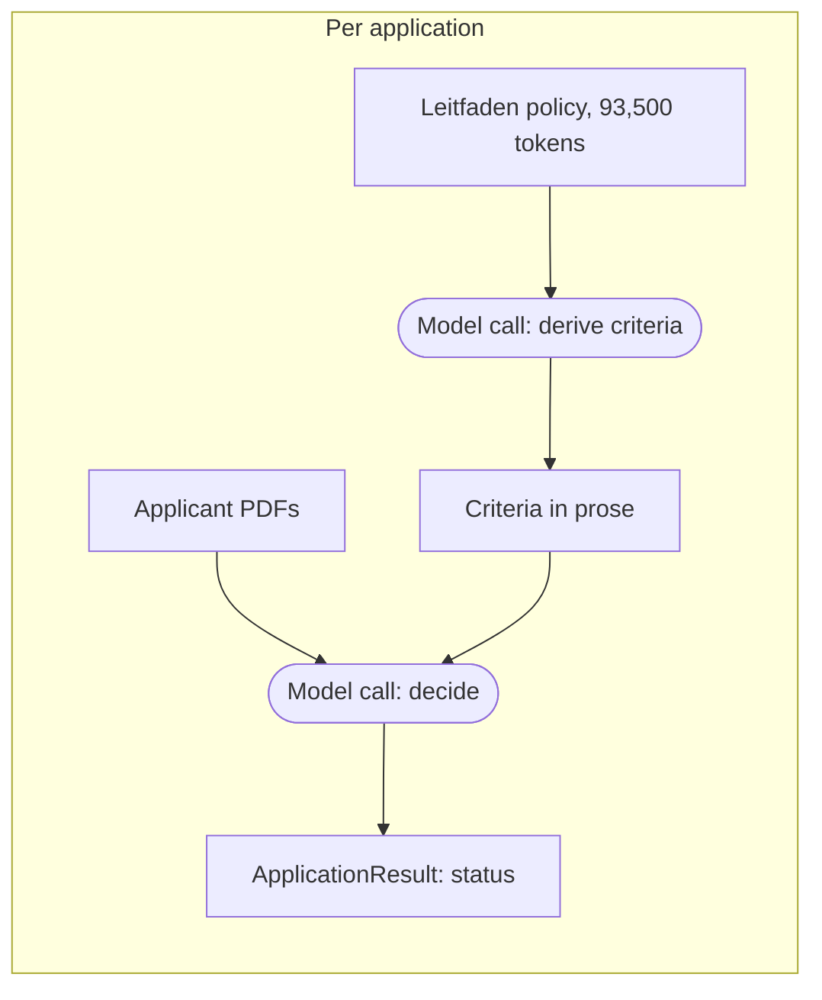

Nothing is prepared in advance. Every application sends the whole policy and the applicant's
documents through two model calls, and the second call decides the status.

**Pros**

1. **Build cost:** easy to build and maintain.
2. **Coverage:** decides cases nobody encoded, because the model reads the whole policy
   rather than a fixed set of rules.
3. **Policy freshness:** an edit to the handbook takes effect on the next application, with
   no release and no engineering work.

**Cons**

1. **Repeatability:** the answer changes between identical runs.
2. **Traceability:** a decision cannot be tied to a named rule, so a rejected applicant
   cannot be given a stable reason.
3. **Running cost:** the whole 93,500-token policy is sent on every application, about 7.6
   times the input tokens of option A.

**Cost and effort.** Low to build, high to run.

**Option C: Agentic RAG with TOC(Table of Contents) Navigation / Chunkless RAG**

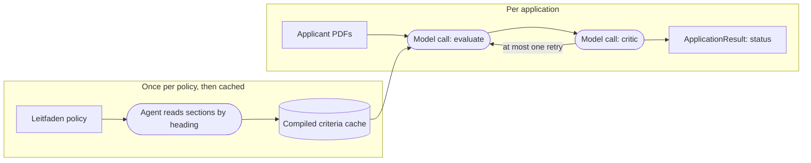

The policy is read once by an agent that opens whole sections by heading, and the criteria
are cached and reused. Per application a model decides, and a second model reviews that
decision and may force one retry.

**Pros**

1. **Whole sections:** retrieval returns entire sections, so no criterion is split across a
   chunk boundary and no surrounding condition is lost.
2. **Running cost:** the policy is read once and the criteria are cached, so an application
   no longer carries the whole handbook.
3. **Self-checking:** a second model reviews each verdict and can force one retry.

**Cons**

1. **Repeatability:** the per-application decision is still a model call, so identical runs
   can disagree.
2. **Criteria quality:** what gets compiled depends on which sections the agent opened, and
   a section it skipped narrows the policy with no signal that anything is missing.
3. **Extra calls:** two model calls per application, plus a retry when the critic rejects,
   so latency and cost per application are higher than option A.

**Cost and effort.** Medium.

**Option D: Agentic RAG with vector retrieval**

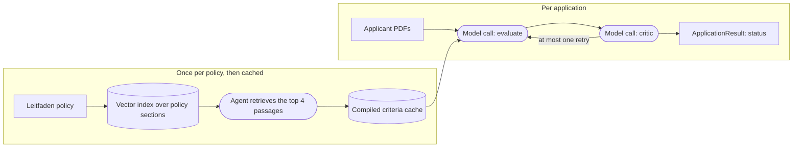

Option D has the same shape as option C. The agent finds policy text through a vector index
built with `text-embedding-3-small` instead of opening sections by heading, so it does not
need to know how the handbook is laid out.

**Pros**

1. **No layout knowledge needed:** the agent finds policy text by meaning, so it does not
   depend on a table of contents or on stable headings.
2. **Scales to larger policies:** works where the section list is too long to enumerate,
   which is the case once many programs are in scope.
3. **Running cost:** as in option C, the policy is read once and the criteria are cached.

**Cons**

1. **Retrieval misses:** top-k retrieval can skip a section a human would have opened, and
   the miss is silent.
2. **Index to maintain:** the vector index has to be built, versioned, and invalidated when
   the handbook changes.
3. **Repeatability:** as in option C, the per-application decision is still a model call, so
   identical runs can disagree.

**Cost and effort.** Medium.

**Measured comparison.** All four options were run end to end over the same personas with three
repeats each. The results are in section 4.2.

**Chosen.** Option A, extraction into typed facts followed by a compiled rules engine, with
option C or D as the route for policies that are too large or too fluid to encode by hand.

**Rationale.** Option A is chosen for reliability and accuracy, with cost agreeing.

1. **Reliability:** a model is stochastic, so the same bundle can come back with a different
   status on a re-run. Option B changed its answer on 7 of 15 personas across three
   identical repeats, and option A changed on none, because code makes the decision.
2. **Accuracy:** the rules engine matched the expected status on 13 of 14 labeled personas,
   and option B matched on 8.
3. **Division of work:** a model is good at reading a document and pulling out the facts,
   and it is weak at holding a long list of conditions in view and settling on accept or
   reject. Option A gives extraction to the model and the decision to code.
4. **Cost:** option A never sends the policy to the model, and option B sends 93,500 tokens
   of it with every application.

**Trade-off accepted.** What option A costs is the work of building the rules and keeping
them current.

1. **Authoring effort:** turning the handbook into rules takes effort to do consistently.
   The rules are written in one fixed DSL, so the shape of a rule is settled and the work is
   authoring rather than design.
2. **Human review:** every rule has to be read and approved by someone who knows the
   admissions policy, which adds a review step before each release.
3. **Expressiveness:** a condition the DSL cannot state cannot be encoded at all, so unusual
   cases and cases with many interacting conditions fall to a caseworker as MANUAL_REVIEW.
4. **Maintenance:** each policy release means revisiting the rules and running the review
   again, which is engineering work and a release rather than a prompt edit.

Option B would have covered more cases from the start and needed almost nothing built, and
it would have decided those cases unrepeatably.

**Caveats.**

1. **Prototype stage:** the agentic options were built as prototypes and measured once. The
   prompts were not tuned, and there is no evaluation set driving the retrieval settings.
   Parameters such as the number of navigation turns and the retrieval depth were set by
   hand and left alone.
2. **Evidence:** with real applications, a labeled evaluation set, and a round of tuning,
   options B, C, and D could all score higher, and the decision could go the other way.
   Until that evidence exists, the choice stays with the option that already gives the same
   answer every time.
3. **Test data is intentionally difficult:** the personas are synthetic and were written to be hard, and each one
   carries several ways to fail at once, for example a missing transcript together with an
   expired language certificate. Accuracy is low across all four options for that reason,
   so the absolute numbers are not what any option would score on a normal intake. The
   comparison between the options still holds, because all four were scored on the same
   personas.

#### D2.1: How the synthetic evaluation data was generated

**Context.** No real applications are available, and real applicant documents are personal
data, so the system had to be measured against a set that was built rather than collected.
The set also feeds D1, because the four architectures were compared on these bundles.

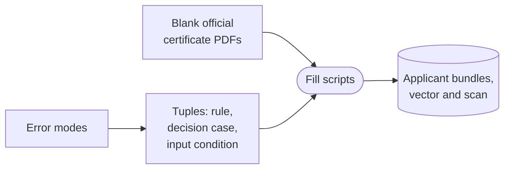

1. **Find the error modes.** Four failures were written down first, and every case exists to
   provoke one of them.
   - Extractor misses or cannot read a required field: `REQUIRED_FIELD_ABSENT`, `REQUIRED_FIELD_ILLEGIBLE`.
   - Fact builder merges two documents into one qualification wrongly: `MIXED_BUNDLE`.
   - Evaluator treats unknown as false and rejects instead of asking: `REQUIRED_FACT_UNKNOWN`.
   - Resolution rejects although another rule succeeded: `MULTIPLE_RULES`, `NO_RECOGNIZED_RULE`.
2. **Write the tuples.** Each case is a triple of rule, decision case, and input condition,
   with the expected result recorded before any document exists. There are 31 in `samples/blank-documents/eval-tuples.md`.
3. **Download blank official templates.** 18 real blank certificates, such as the KMK Abitur
   Musterentwurf, so the layout is the one an admissions office receives.
4. **Write fill scripts.** 10 scripts overlay synthetic data at coordinates measured from each
   template, and each also emits a 150 dpi scan, which is how the unreadable cases are made.
5. **Generate the bundles.** 27 applicant folders, each with a YAML of the intended facts and
   the PDFs a rule has to read.

Working from tuples rather than from documents is what makes the set adversarial. Every case
exists because a specific failure was predicted for it, so the set stresses the pipeline
instead of sampling it.

**Status.** Implemented. The 31 tuples are mirrored in `test/fixtures/rules_engine/scenarios.yaml`,
and 15 representative ones run as gold scenarios in the test suite on every change to the
rules.

**Trade-off.** The set is deliberately hard, so absolute accuracy on it is lower than a real
intake would produce, and only the comparison between systems carries over.

#### D2.2: LLM as a judge

**Context.** Two things go wrong independently. The rules can be evaluated incorrectly, and
the facts can be extracted incorrectly. Only the first is deterministic, so the gold scenarios
pin the evaluator and say nothing about extraction, because the facts are their input.

**Options.**

| Option                                         | Verdict                                                                                                                                                                              |
| ---------------------------------------------- | ------------------------------------------------------------------------------------------------------------------------------------------------------------------------------------ |
| A. Gold scenarios only                         | Not enough alone. Fast, free, and deterministic, and silent on extraction.                                                                                                           |
| B. Compare extracted facts to the persona YAML | Should be built, and is not. Every synthetic PDF was generated from a YAML that records the intended facts, so the comparison is exact and free. It only ever covers synthetic data. |
| C. Human review of sampled applications        | Later. The only ground truth that counts for a regulated decision, and too slow to gate a release.                                                                                   |
| D. LLM judges over the applicant documents     | Chosen. The only option that reaches real applications, where nothing generated the document.                                                                                        |

**One judge per way extraction fails.** Splitting by output status was rejected, because the
status is produced by code from the facts and the gold scenarios already pin that mapping, so a
judge asking whether an `ELIGIBLE` is correct can only re-derive deterministic logic or check
extraction under another name.

| Judge              | Question                                                              | Catches           |
| ------------------ | --------------------------------------------------------------------- | ----------------- |
| `FABRICATED_VALUE` | Does the document contain this value at all?                          | too much          |
| `OMITTED_EVIDENCE` | Was a field the schema defines left empty while a document states it? | too little        |
| `EVIDENCE_STATE`   | Is `KNOWN`, `MISSING`, `UNREADABLE`, or `CONFLICTING` the right one?  | wrong uncertainty |

`EVIDENCE_STATE` is the one the design most depends on, because D4 rests the safety argument on
those four states and a `KNOWN(false)` where the truth is `UNREADABLE` produces a wrongful
rejection. `OMITTED_EVIDENCE` does not ask whether an omission would change the outcome, since
that is computable by re-running the rules engine with the missing fact supplied.

**How a judge is trusted.** It is scored on agreement with human PASS and FAIL labels separately,
since raw accuracy rewards a judge that passes everything. Few-shot examples come from a test split
the measurement never sees.

**Trade-off.** Coverage of extraction is bought with a second model-based system that itself
needs validating, so judge calibration is a standing cost.

#### D3: Which outcomes may be issued without a caseworker

**Context.** Every outcome the service issues on its own removes a caseworker interaction, and
every outcome it issues wrongly is a regulated decision made without a human. The two failure
directions do not cost the same. A wrong MANUAL_REVIEW costs staff time, and a wrong ELIGIBLE
admits a student who does not qualify, which is an accreditation problem.

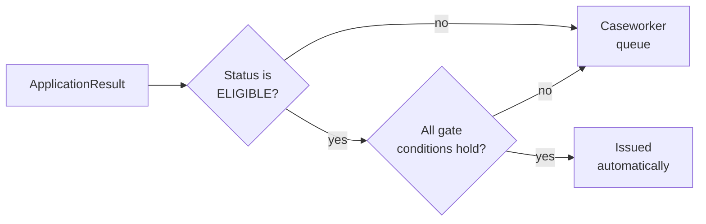

**Options.**

| Option                                                                 | Verdict                                                                                                                                    |
| ---------------------------------------------------------------------- | ------------------------------------------------------------------------------------------------------------------------------------------ |
| A. No autonomy, every result is a recommendation a caseworker confirms | Interim. No wrong decision reaches an applicant, and it produces the labels the gate needs, but the saving is speed rather than headcount. |
| B. Autonomy on ELIGIBLE only                                           | Chosen. Removes the human from the largest and cleanest group, and the gate is auditable and can be tightened.                             |
| C. Autonomy on ELIGIBLE and INELIGIBLE                                 | Rejected. A wrong INELIGIBLE rejects a qualified applicant silently, which is the worst outcome in the system.                             |
| D. Full autonomy with sampled human audit                              | Rejected. Unacceptable while the accuracy floor is unmeasured.                                                                             |

Option A stands until the false-eligible rate is measured and signed off, then option B takes
over.

#### D4: How unknown evidence is represented

**Context.** The system has to tell "the document says no" apart from "we could not read it"
and "we never received it", because each one leads to a different action. Collapsing them
causes wrongful rejection, which is the worst failure in the system.

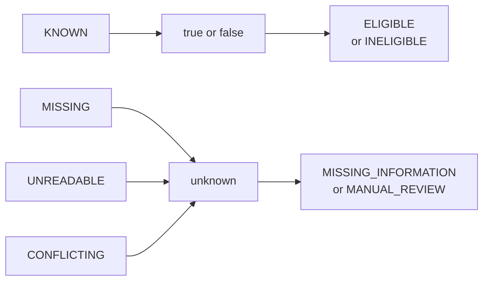

**Options.**

| Option                                      | Verdict                                                                                                                    |
| ------------------------------------------- | -------------------------------------------------------------------------------------------------------------------------- |
| A. Confidence scores and thresholds         | Rejected. The score is uncalibrated and cannot be audited, and it cannot express two documents that contradict each other. |
| B. Four evidence states, three-valued logic | Chosen. Every fact is KNOWN, MISSING, UNREADABLE, or CONFLICTING, and a condition returns true, false, or unknown.         |

**Rationale.** INELIGIBLE is reachable only when every applicable rule failed on facts reported
as KNOWN. A fact the model missed becomes MISSING and routes to a request for information, so
a recall miss cannot turn into a rejection.

**Trade-off.** More MISSING_INFORMATION in exchange for fewer wrong rejections. The error the
system makes most often is asking for a document it did not strictly need.

**Revisit trigger.** Applicant round trips cost more than the manual reviews they replaced.

#### D5: Where the policy lives and how rules are authored

**Context.** The prototype encodes five rules for one Bachelor program. IU runs many programs
and revises the handbook, so whatever encodes the policy has to be reviewable by admissions
staff, versioned for audit, and cheap enough to extend that writing rules does not become the
new bottleneck.

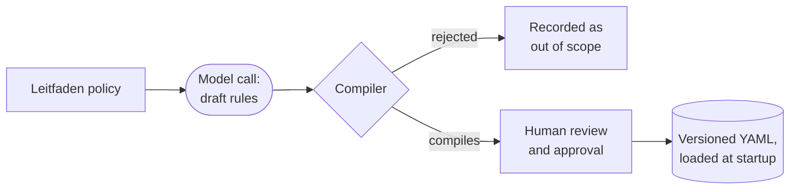

**Options.**

| Option                                                                      | Verdict                                                                                                                                                |
| --------------------------------------------------------------------------- | ------------------------------------------------------------------------------------------------------------------------------------------------------ |
| A. Rules as Python predicates                                               | Rejected. Only engineers can read a rule, so admissions staff cannot review the policy, and a policy change is a code change with no separate version. |
| B. An existing business rule management system                              | Rejected. Heavy dependency for five rules, and three-valued logic would have to be forced into its model.                                              |
| C. Hand-authored versioned YAML, compiled at startup                        | Basis of the choice. Rules read as requirements, and the compiler rejects a broken package at boot, so it can never screen an applicant.               |
| D. Option C, plus a model drafting rules from the handbook for human review | Chosen. Cuts the cost of the first draft for each new program, and no unreviewed rule ships.                                                           |

**Trade-off.** Expressiveness in exchange for reviewability. Anything the DSL cannot say
cannot be a rule, and the escape hatch is MANUAL_REVIEW rather than arbitrary code, so some
real admissions rules will not be automatable in their current form.

**Revisit trigger.** A program's rules cannot be expressed in the DSL, or hand review of
generated rules becomes the new bottleneck.

#### D6 to D8: Extraction, input handling, and tracing

The remaining decisions are consequential, and reversing any of them would not redesign the
service.

| Decision                                                                                                                   | Chosen                                                                       | Why                                                                                                                                                                                                   | Trade-off                                                                                                                                                                                                              |
| -------------------------------------------------------------------------------------------------------------------------- | ---------------------------------------------------------------------------- | ----------------------------------------------------------------------------------------------------------------------------------------------------------------------------------------------------- | ---------------------------------------------------------------------------------------------------------------------------------------------------------------------------------------------------------------------- |
| **D6. Extraction granularity.** One model call per bundle, or one per document with a reconciliation layer.                | One call for the whole bundle.                                               | One call sees every document at once, so it can report a contradiction between two certificates. Splitting the call per document moves the same problem into a merge step that still has to be built. | A value can be attributed to the wrong qualification, and no judge covers that today. Observed on the anna-beispiel bundle, where two parts of one qualification were split into two. A missed conflict cannot happen. |
| **D7. Reading PDFs.** Send the PDF to the model, run OCR first, or send both.                                              | Send the PDF to the model.                                                   | The model sees the page as it was printed, so a value stays attached to its label and its page number                                                                                                 | Image tokens on every page, and no local fallback when the provider is down, so a run fails with a typed error rather than degrading.                                                                                  |
| **D8. Tracing.** Full content everywhere, redaction by construction, or full content now with redaction as a release gate. | Full content in the prototype, redaction as a gate before any real document. | The applicants are synthetic, so there is nothing to protect. Every run of all four options in D1 sends its prompts and responses to LangSmith in full, so we can read back what each one did.        | Safety depends on the gate being enforced rather than on the code refusing.                                                                                                                                            |

### 4.2 Measured comparison

All four options in D1 were run over the same personas, three repeats each. Accuracy is scored
against the expected status recorded in the tuples, over 9 core personas and 14 labeled personas.
Stability is the share of 15 personas whose status changed across the three identical repeats.

One caveat applies to every number below. Option B was run on `gpt-5.6-terra` and options C and D
on `gpt-5.4-mini`, so the comparison carries a second variable and the gap between B and C or D
is not attributable to architecture alone. The gap to option A is, because option A makes its
decision in code and no model is involved. A rerun on one model is planned, and every model in
the repository is now set by `ADMISSIONS_OPENAI_MODEL`.

| Measure                                          | A. Rules engine | B. Full policy workflow | C. Agentic RAG, table of contents | D. Agentic RAG, vector retrieval |
| ------------------------------------------------ | --------------- | ----------------------- | --------------------------------- | -------------------------------- |
| Accuracy, 9 core personas                        | 8 of 9, 89%     | 4 of 9, 44%             | 5 of 9, 56%                       | 5 of 9, 56%                      |
| Accuracy, 14 labeled personas                    | 13 of 14, 93%   | 8 of 14, 57%            | 7 of 14, 50%                      | 9 of 14, 64%                     |
| Personas whose status changed across repeats     | 0 of 15         | 7 of 15                 | 7 of 15                           | 9 of 15                          |
| False admits, applicants wrongly called ELIGIBLE | 0 of 9, 0%      | 1 of 27, 3.7%           | 6 of 27, 22.2%                    | 4 of 27, 14.8%                   |
| Model calls per application                      | 1               | 2                       | 4.7                               | 4.8                              |
| Input tokens per application                     | 14.3k           | 108.7k                  | 76.5k                             | 74.5k                            |
| Policy tokens per application                    | 0               | 93.5k                   | 3.1k                              | 2.8k                             |
| Latency per application                          | 16 s            | 90 s                    | 28 s                              | 29 s                             |
| Cost per decision                                | $0.033          | $0.212                  | $0.026                            | $0.025                           |

The rules engine wins on both accuracy measures, and it is the only option that returns the
same status on every repeat. It is also the only one that never admits an applicant who does
not qualify, which is the failure D3 is built to prevent. Sending the whole policy costs the
most tokens and the most time, and it buys the least accuracy. Retrieval cuts the policy cost
from 93,500 tokens to about 3,000 and does not recover the accuracy.

The four screenshots below are taken from [measured-comparison.html](measured-comparison.html),
which is the full report and holds the per applicant tables the screenshots crop. Its option C
figures predate the completed run, so the table above is the current one where the two differ.

**Verdict per option.** Accuracy, stability, and policy cost for each of the four
architectures, with the rules engine as the reference.

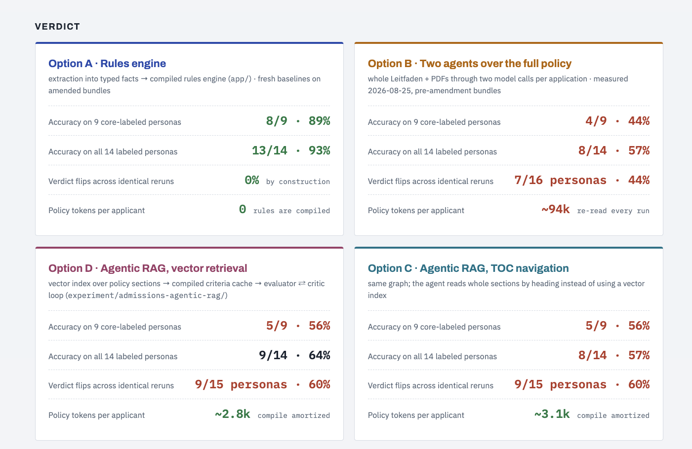

**Per applicant outcomes.** Every persona, its expected status, and what each option returned
on each of the three repeats. A row marked FLIP is a persona whose status changed across
identical runs.

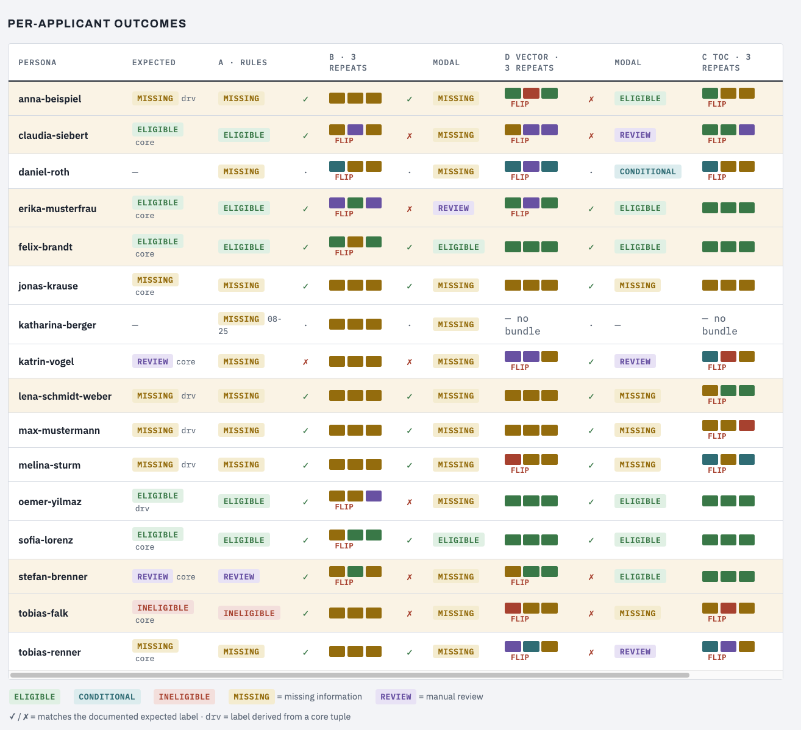

**Detection rate per status.** For each status, the share of applicants that should have
received it and did, and the share that received it wrongly. The row that governs D3 is the
false admit rate, meaning applicants wrongly called ELIGIBLE.

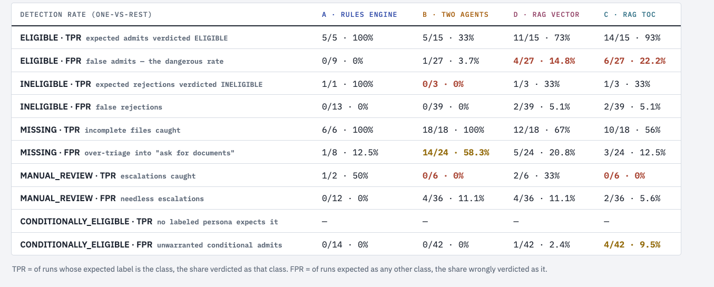

**Cost and tokens.** Model calls, tokens, latency, and cost for one application, and what a
second run of a saved case costs.

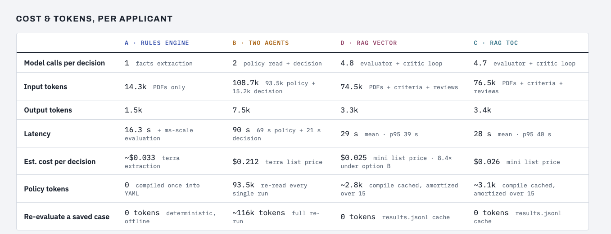
