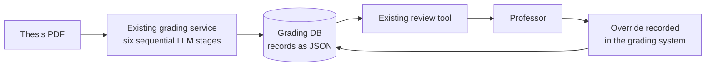
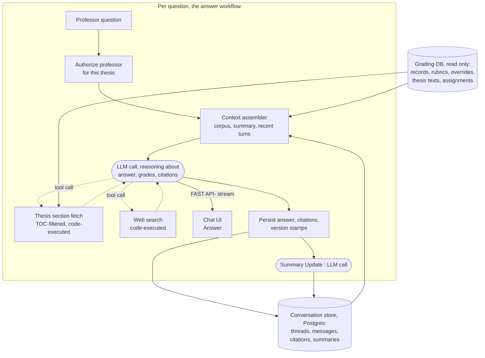
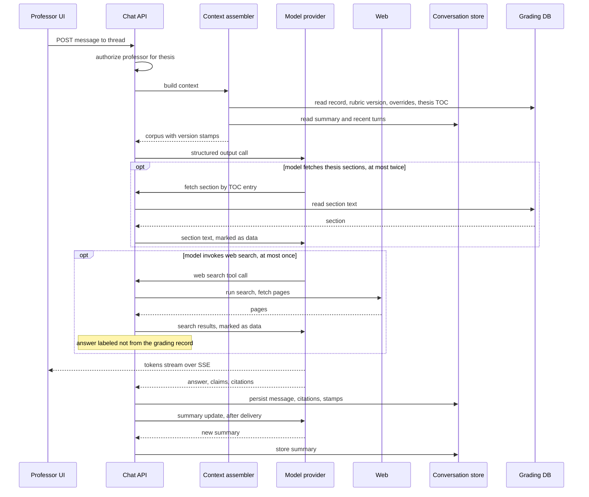
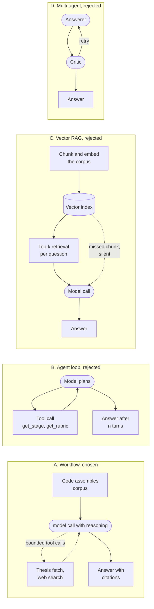
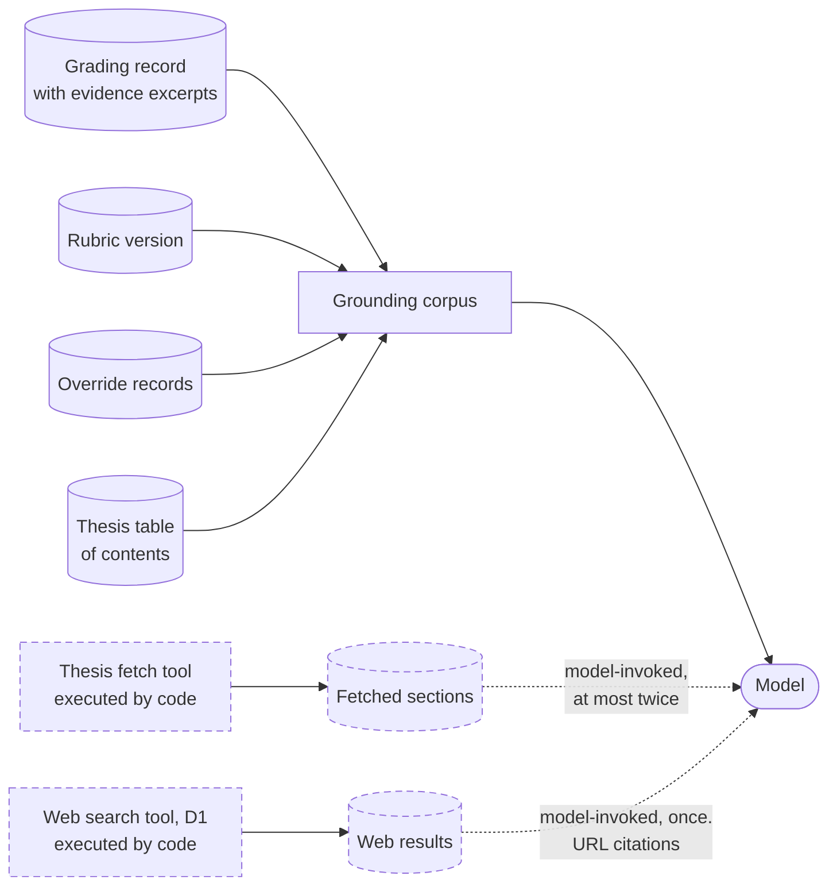
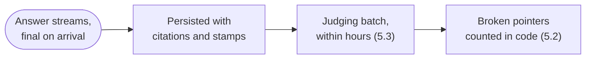
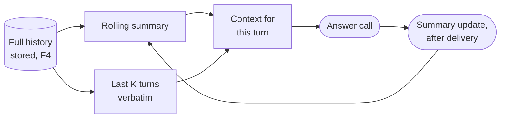
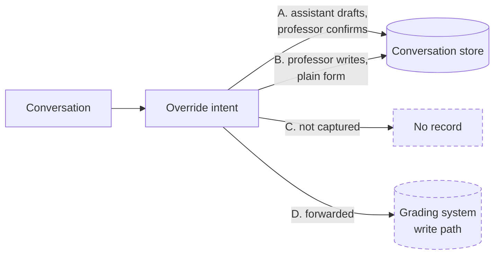
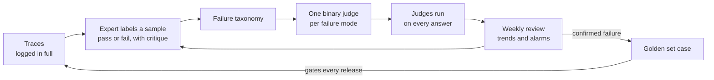

# IU Case Study - Thesis Grading Chat Application

## 0. Summary

- **What it is.** A chat assistant that answers a professor's questions about one
  thesis's grading, so confirming an AI-generated grade no longer means digging through
  six stages of nested JSON by hand.
- **What it may read (D2).** The grading record with its stored evidence, the rubric
  version that grading used, the override records, and thesis sections fetched on demand
  through the table of contents.
- **How it answers (D1).** A deterministic workflow, not an agent. Code assembles the
  corpus into one structured call, and the model's only autonomous actions are two
  bounded, code-executed tools, a thesis section fetch and one web search.
- **How citations work (D4).** Each claim points at evidence the grading system already
  stored, trusted rather than validated in the answer path. The judging pipeline counts
  bad pointers, so validation can be added if the trust proves wrong.
- **What persists (D5, D7).** Conversations live in Postgres and resume weeks later, and
  every answer stores the record and rubric versions it used, so it stays explainable in
  an audit.
- **How quality is measured (Section 5).** Code metrics on every answer, validated LLM
  judges within hours, weekly expert labeling, and a golden set that gates every release.

**Decision summary**

| #   | Decision                            | Chosen                                                                    | Why (one line)                                                          |
| --- | ----------------------------------- | ------------------------------------------------------------------------- | ----------------------------------------------------------------------- |
| D1  | Agent or workflow                   | Deterministic workflow, one structured call, two bounded tools            | The whole grading record is in view, so a wrong answer about the grading is never a missed lookup |
| D2  | What the assistant may read         | Record, rubric version, overrides, and thesis sections via a TOC fetch tool | Any passage stays reachable, and only the passages asked about are paid for |
| D4  | Citation checking                   | Trust the stored evidence and monitor, no validation in the answer path  | Nothing is built for a failure not yet shown, and the judging batch counts bad pointers |
| D5  | What a conversation remembers       | Rolling summary plus recent turns verbatim                               | Context stays bounded, and resuming an old thread is one read           |
| D6  | Override intent capture             | Left open for IU                                                         | A governance question, options presented without a choice               |
| D7  | Smaller decisions                   | FastAPI with SSE, provider adapter, Postgres store, LangSmith tracing    | See Section 4                                                           |

---

## 1. Introduction

### 1.1 Problem and motivation

**What exists today**

- An existing production service grades each thesis through six sequential LLM stages, for
  example structure, methodology, and argumentation, each with sub-categories.
- Each stage returns scores, reasoning, evidence, and deductions or bonuses as structured
  output validated by Pydantic models. Later stages build on earlier results.
- The full grading record for one thesis is stored as JSON in a database.

**The problem**

- A professor must confirm each AI-generated grade, and the scores alone do not show why a
  stage scored the way it did.
- A question such as "Why was methodology scored low?" has its answer somewhere in the
  grading record, but the professor has to dig through six stages of nested output by hand.
- When the professor disagrees, they override the grade, and that override should rest on
  what the record actually says. A wrong answer from an assistant is worse than no
  assistant, because it can cause a wrong override or wrongly confirm a bad grade.

**Assumed scale, to be confirmed with IU**

- A professor is responsible for roughly 200 theses, stated as "hundreds" in the case
  description.
- One grading record is tens of KB of JSON across six stages with three to five
  sub-categories each.
- One thesis is roughly 60 to 100 pages, and its extracted text is tens of thousands of
  tokens.
- A professor may return to a conversation days or weeks later, so no conversation state
  can live only in process memory.

### 1.2 Goals

**What the service delivers**

- A chat assistant that answers a professor's questions about the grading of one thesis,
  so confirming an AI-generated grade no longer requires a manual dig through the record.
- A conversation is tied to one professor and one thesis, and it can be resumed weeks
  later without loss.
- Web-supported answers, clearly separated. When a question needs knowledge beyond the
  grading record, the assistant can search the web (D1). Such answers cite URLs and are
  marked as not from the grading record.

**What makes an answer trustworthy**

- The assistant answers only from the grounding corpus, meaning the grading record, the
  rubric version that grading used, the override records, and the thesis sections it
  fetches on demand.
- Every claim cites the record field or the thesis passage behind it.
- When the record does not contain the answer, the assistant says "the grading record does
  not contain this" instead of guessing.
- When a grade was overridden in the grading system, the assistant discloses it, including
  the case where later stages were derived from the pre-override score.
- Trust is treated as a measurable property. Section 2 sets the grounding requirements,
  and Section 5 defines how answer quality is monitored after release.

### 1.3 Non-goals

The following work is outside the scope of this TDD:

- **Grade changes.** A grade change is always the professor's action in the existing grading
  system, which stays the system of record. The service never changes a grade and does not
  re-run later stages after an override. Whether it captures the professor's override
  intent, meaning what to change and why, is an open decision presented in Section 4.
- **Re-grading the thesis.** The assistant can fetch thesis sections so it can show the
  passages behind the grading, but the assistant never produces its own
  assessment of the thesis. It explains the stored assessment, and Section 5 watches for
  answers that assess instead of explain.
- **Questions across theses**, such as "which of my theses scored below 60 on methodology".
  Aggregation is a reporting feature on structured data, not a grounded chat answer.
- **Student access.** The assistant is available only to professors and the grading platform
  team, and no student-facing surface will be built. The deliverable is the REST API and
  the answer service behind it.

### 1.4 Stakeholders

| Stakeholder           | Role            | What they own or decide                                                                 |
| --------------------- | --------------- | --------------------------------------------------------------------------------------- |
| Grading platform team | Technical owner | Design, build, evaluate, and operate the assistant service                              |
| Professors            | Users           | Ask questions, judge the answers, and decide and record overrides in the grading system |

### 1.5 Definitions

| Term             | Definition                                                                                                                                                                      |
| ---------------- | ------------------------------------------------------------------------------------------------------------------------------------------------------------------------------- |
| Grading record   | The stored JSON produced by the six-stage grading run for one thesis: scores, reasoning, evidence, and deductions or bonuses per stage and sub-category.                        |
| Stage            | One of the six sequential grading steps, each with sub-categories. A later stage builds on the results of earlier stages.                                                       |
| Rubric version   | The versioned grading criteria a stage was run against. An answer about what a higher score requires must cite the version used for that thesis.                                |
| Conversation     | The persistent message thread for one professor and one thesis. It is the unit of resumption and of audit.                                                                      |
| Grounding corpus | The only data the assistant may use in a conversation: that thesis's grading record, the rubric version it was graded with, its override records, and the thesis sections it fetches on demand.          |
| Citation         | A pointer from a claim in an answer to what supports it: a stage, sub-category, and field of the grading record, or a quoted passage of a fetched thesis section. A citation is a location rather than a copy of the evidence, and the UI resolves it against the grading record for display. |
| Override         | A professor's recorded decision in the grading system that replaces an AI-generated score. This service reads overrides and never writes them.                                  |
| Override intent  | A structured note from the professor about a grade change they plan to make: stage, sub-category, proposed score, and their own reasoning. Whether the service captures it is an open decision in Section 4. |
| Grounded answer  | An answer whose every factual claim is supported by the grounding corpus. Section 5 defines how this is measured.                                                               |

---

## 2. Requirements

### 2.1 Functional (F)

| ID  | Requirement                                                                                                                                                                                                                         | Priority |
| --- | ----------------------------------------------------------------------------------------------------------------------------------------------------------------------------------------------------------------------------------- | -------- |
| F1  | The service must answer questions about one thesis's grading using only that thesis's grounding corpus, meaning the grading record, the rubric version that grading used, its override records, and the thesis sections it fetches on demand.               | Must     |
| F2  | Every factual claim in an answer must cite its source, a grading-record path or a thesis passage, so the professor can check any sentence against the grading record. How far the service verifies its own citations is decided in D4 and measured in Section 5. | Must     |
| F3  | When the grounding corpus does not contain the answer, or the question is not about this thesis's grading, the service must say so and must not answer from general knowledge.                                                      | Must     |
| F4  | A conversation must be persistent, resumable, and auditable: one thread per professor and thesis, with the full history of questions, answers, and their citations stored, listable by the professor, and usable again weeks later. | Must     |
| F5  | A professor must be able to access only theses assigned to them. The platform team may read conversations for evaluation. Thesis assignments come from the existing grading system.                                                 | Must     |
| F6  | Answers should stream progressively to the client rather than arrive only as one final response.                                                                                                                                    | Should   |
| F7  | The service should answer in the language of the professor's question, while grading records and rubrics may be in German or English.                                                                                               | Should   |
| F8  | The service could capture the professor's override intent and link it to the conversation. Whether and how to capture it is the open decision presented in Section 4.                                                               | Could    |

### 2.2 Performance and scale (P)

| ID  | Requirement              | Target                | How measured                                          |
| --- | ------------------------ | --------------------- | ----------------------------------------------------- |
| P1  | First token latency, p95 | 2 s, assumed          | Time from request to first streamed token, per answer |
| P2  | Full answer latency, p95 | 15 s, assumed         | Time from request to final token, per answer          |
| P3  | Concurrent conversations | 50 sustained, assumed | Load test with synthetic grading records              |

### 2.3 Security and compliance (S)

| ID  | Requirement                                                                                                                                                                                                                                                            |
| --- | ---------------------------------------------------------------------------------------------------------------------------------------------------------------------------------------------------------------------------------------------------------------------- |
| S1  | Open. Grading records and conversations contain student and professor personal data under GDPR. Before any real thesis is processed, the service needs a PII and retention design, and provider terms that keep LLM processing in the EU with no training on the data. |
| S2  | Open. Conversations are audit artifacts, so retention must at least cover IU's grade appeal window. The exact period is a business decision for IU.                                                                                                                    |

---

## 3. Architecture

### 3.1 Current state



The grading service writes a structured record per thesis, and the professor sees the
scores in the existing tool. The reasoning behind a score sits in nested JSON across six
stages, so answering "why" means reading the record by hand. Nothing links an override to
the reasoning that justified it.

### 3.2 Proposed state: a workflow, not an agent

The assistant is a deterministic workflow, not an agent. Code assembles the grounding
corpus, one structured call answers, and code owns every loop. The model holds exactly
two tools, both code-executed: a thesis section fetch, filtered through the table of
contents and bounded to two rounds per answer, and web search, bounded to one round and
meant for questions the corpus cannot answer. Code observes every tool call and labels
the answer accordingly. The reasons are argued in D1.



**Assumption.** The grading system already stores the citations behind its reasoning, and this service relays them without validating them (D4).

**Loops and retries.** The system has no open-ended loop. The model's autonomous
actions are the bounded tool rounds, at most two thesis fetches and one web search per
answer.

1. A transient provider error on the answer call is retried up to three times with
   exponential backoff.
2. A failed summary update is skipped and retried on the next turn. The answer is already
   delivered, and the stored full history means no information is lost.

**The thesis fetch tool.** The corpus holds the thesis's table of contents rather than
its full text. When a passage matters, the model requests a section by its TOC entry, at
most twice per answer.
**The web search tool.** When a question needs knowledge the corpus cannot supply, the
model may invoke web search, at most once per answer.

### 3.3 Data flow

#### One question, the main path



The answer returned to the professor carries its claims and stamps, so the UI can show
what supports each sentence. A citation is a location, and the UI resolves it against
the grading record to display the stored evidence:

```json
{
  "answer": "Methodology scored 62 because two deductions applied ...",
  "claims": [
    {
      "text": "the sample size justification was marked insufficient",
      "citation": {
        "source": "record",
        "stage": "methodology",
        "sub_category": "study_design",
        "field": "deductions[0]"
      }
    },
    {
      "text": "the thesis reports twelve participants",
      "citation": {
        "source": "thesis",
        "quote": "our sample consisted of 12 participants",
        "page": 41
      }
    }
  ],
  "record_version": "sha256:9f2c...",
  "rubric_version": "thesis-rubric 3.2"
}
```

#### Failure path

A failed turn produces a typed error event, never a plausible ungrounded answer.

| Stage             | Failure                              | Behavior                                                                                                 |
| ----------------- | ------------------------------------ | -------------------------------------------------------------------------------------------------------- |
| Authorization     | Professor not assigned to the thesis | 403 before any model call                                                                                |
| Corpus read       | Record missing or unparseable        | Typed error, "grading record unavailable", no answer                                                     |
| LLM call          | Transient provider error             | Up to three retries with exponential backoff, then a typed error                                         |
| LLM call          | Invalid structured output            | One regeneration, then a typed error                                                                     |
| Thesis fetch tool | Section missing or unreadable        | The tool returns a typed error, and the answer continues without it, saying the section was unavailable  |
| Summary update    | Any failure                          | Skip, flag the thread, retry next turn, the answer is unaffected                                         |
| Web search tool   | Search or page fetch fails           | The tool returns a typed error, and the answer continues from the corpus alone, saying the search failed |

---

## 4. Design

### 4.1 Design decisions

#### D1: Agent or workflow

**Context.** The default reflex for "chat over your data" is an agentic loop with
retrieval tools. Whether this system needs one is the decision everything else hangs off.
The corpus for one conversation is one grading record, one rubric version, the override
records, and the thesis table of contents, roughly 10 to 30k tokens assumed, with
thesis sections fetched on demand (D2). (F1, F2, P1, P2)



| Option                                                                                                                                                | Verdict                                                                                                                                                                                                                                                                            |
| ----------------------------------------------------------------------------------------------------------------------------------------------------- | ---------------------------------------------------------------------------------------------------------------------------------------------------------------------------------------------------------------------------------------------------------------------------------- |
| A. Deterministic workflow. Code assembles the corpus, one structured call answers, and the model holds two bounded tools, thesis fetch and web search | **Chosen.** What the model saw always includes the whole grading record, so a wrong answer about the grading is never explained by a missed lookup. No retrieval infrastructure, bounded latency, and prompt caching keeps repeat turns cheap because the corpus prefix is stable. |
| B. Agentic loop. The model plans and fetches through tools such as get_stage, get_rubric                                                              | **Rejected.** Reads become nondeterministic, a stage the model never opened silently narrows the answer, each answer costs extra calls and latency, and tool access widens what injected text in the student-written thesis could do.                                              |
| C. Vector RAG pipeline over chunks                                                                                                                    | **Rejected.** Chunking breaks the stage and field paths that citations point at, and a retrieval miss is silent.                                                                                                                                                                   |
| D. Multi-agent. An answerer plus a critic that judges every answer before delivery                                                                    | **Rejected for the blocking path.** A second model on every answer roughly doubles cost and latency, and the critic itself needs calibrating. Judging moves to Section 5, where it runs on samples instead of in the request path.                                                 |

**Rationale**

- **Division of work.** The model does the language work: reading, explaining, citing.
  Code decides what is read, what is valid, and what is stored.
- **Nothing to fetch about the grading.** The whole record is always in view, and only
  thesis sections and the web sit behind bounded, code-executed tools.
- **The professor is the loop.** Follow-up questions are the iteration, and every step
  is grounded and cited.

**Trade-off**

- **Helpfulness is corpus-bound.** The model can only be as helpful as the assembled
  corpus.
- **Cost scales with the corpus.** Token cost per answer follows record size and the
  sections fetched, not question size. Prompt caching softens this within a thread.

**The web search tool**

- **Why it exists.** Field questions such as "is this sample size normal for this
  method" have no answer inside the corpus.
- **How it runs.** The model decides autonomously when to search, at most one round per
  answer. Code executes the search and the page fetches, and returns the results marked
  as data the model must not follow as instructions (3.2).
- **Why not professor-invoked.** Considered and set aside. It is structurally safer,
  because web content could never enter unasked, but it makes the professor route every
  question.
- **What to watch.** Searching too often, or answering from the record when a search was
  needed. Both are tracked in Section 5.

#### D2: What the assistant may read

**Context.** Trust depends on a closed world: every answer must come from data the
professor can inspect. The candidates are the grading record, the rubric version the
grading used, the override records, and the thesis text itself. Override records are
written by the existing grading system when a professor records an override there, and
this service only reads them. The separate question of capturing override intent is D6.
(F1, F3)



| Option                                                        | Verdict                                                                                                                                                                                                                                                                                                                                                                                       |
| ------------------------------------------------------------- | --------------------------------------------------------------------------------------------------------------------------------------------------------------------------------------------------------------------------------------------------------------------------------------------------------------------------------------------------------------------------------------------- |
| A. Grading record only                                        | **Rejected.** Cannot answer "what would a higher score require", which needs the rubric.                                                                                                                                                                                                                                                                                                      |
| B. Record, rubric version, override records                   | **Rejected.** The evidence excerpts in the record are the grading's own selection, so the professor cannot check a claim against the source document, and a question about the passages around an excerpt ends in a refusal.                                                                                                                                                                  |
| C. Option B plus the full thesis text in every call           | **Rejected.** Cost and latency scale with thesis length on every answer, tens of thousands of tokens for passages most questions never touch, and the whole student-written document becomes prompt input on every call.                                                                                                                                                                      |
| D. Option B plus thesis sections through a bounded fetch tool | **Chosen.** The corpus holds the table of contents, and the model fetches at most two sections per answer, executed by code (3.2). The professor can still ask about any passage, and only the passages asked about are paid for. The re-grading risk stays real: the prompt binds thesis content to an evidence role, and Section 5 judges watch for answers that assess instead of explain. |

#### D4: Citation checking, trust or validate

**Context.** A citation can be wrong in two ways. The stored evidence itself can be
wrong, which is the grading system's responsibility and out of this service's scope. Or
the model can copy a pointer that does not resolve or does not support its sentence.
The decision is what the service does about the second, at answer time. (F2, P1)



| Option                                                                                                    | Verdict                                                                                                                                                                                                                                                                        |
| --------------------------------------------------------------------------------------------------------- | ------------------------------------------------------------------------------------------------------------------------------------------------------------------------------------------------------------------------------------------------------------------------------ |
| A. Trust and monitor. No check in the answer path, the judging batch resolves every citation within hours | **Chosen.** The answer path stays one call plus bounded tools, streaming needs no retract state, and nothing is built for a failure the pilot has not yet shown. The judging batch resolves each citation in code before judging anyway, so bad pointers are counted for free. |
| B. Validate in code before the answer is final, retract and regenerate on failure                         | **Rejected initially.** A validator, a retraction UI state, and a regeneration loop on every answer, bought before any evidence that pointer errors happen at a rate that matters. Kept as the revisit design.                                                                 |

**Trade-off.** A broken citation never stops or changes an answer, so a professor can
act on one before the judging batch counts it hours later. Accepted initially
because pointers are copied from evidence sitting in the model's context. **Revisit trigger:** the unresolvable citation rate in
5.2 crosses about 2% of answers, then option B ships.

#### D5: What a conversation remembers

**Context.** Threads resume after weeks, and context cannot grow without bound. (F4)



| Option                                                                     | Verdict                                                                                                                                                                                                                                                                                                                        |
| -------------------------------------------------------------------------- | ------------------------------------------------------------------------------------------------------------------------------------------------------------------------------------------------------------------------------------------------------------------------------------------------------------------------------ |
| A. Rolling summary plus recent turns                                       | **Chosen.** The service keeps a running conversation summary and sends the model the summary plus the last few turns verbatim. Context stays bounded on every turn, and resuming an old thread is one read instead of a full replay. The summary update runs after the answer is delivered, so it adds no user-facing latency. |
| B. Send every turn verbatim, and close the thread at a token cap           | **Rejected.** Nothing is lost while the thread is open, but at the token limit the professor has to start a fresh thread that carries none of the earlier conversation.                                                                                                                                                        |
| C. Send turns verbatim up to a token budget, then summarize the older ones | **Rejected.**break.                                                                                                                                                                                                                                                                                                            |

**Trade-off.** Summaries are lossy. A nuance from turn 3 can be gone by turn 30, and "as I
said earlier" can resolve wrongly. Recent turns stay verbatim to soften this, and the
stored full history means nothing is lost for audit, only for the model's working memory.
**Revisit trigger:** evaluation shows answers misusing earlier context above a set rate.

#### D6: Override intent capture, left open

**Context.** Professors decide overrides after these conversations. Whether this service
captures the intent, meaning which score to change and why, is a product and governance
question for IU, so the options are presented without a choice. (F8)



| Option                                       | What it means                                                                                                                           | For                                                           | Against                                                            |
| -------------------------------------------- | --------------------------------------------------------------------------------------------------------------------------------------- | ------------------------------------------------------------- | ------------------------------------------------------------------ |
| A. Assistant drafts, professor confirms      | The assistant proposes a structured intent from the conversation, the professor edits and confirms, and code stores it with the thread. | Lowest friction, and the conversation and intent stay linked. | Model-drafted words anchor a regulated decision.                   |
| B. Professor writes it, a plain form         | A form endpoint stores stage, sub-category, proposed score, and reasoning written by the professor without LLM help.                    | The reasoning is authentically the professor's, still linked. | More typing, and some professors will skip it.                     |
| C. No capture                                | The service stays purely read-only.                                                                                                     | Smallest scope and the cleanest boundary.                     | The link between conversation and override decision is lost.       |
| D. Capture and forward to the grading system | After confirmation, the service writes the override into the grading system through its API.                                            | One workflow for the professor.                               | The service enters the grade write path, which Section 1 excludes. |

**Owner:** IU, held in Section 6 open questions. Option B is the smallest step that
preserves the audit link, which is the position the platform team would argue.

#### D7: Smaller decisions

| Decision           | Chosen                                                                                                              | Why                                                                                                                                                                                                                                                                                                                                                      | Trade-off                                                       |
| ------------------ | ------------------------------------------------------------------------------------------------------------------- | -------------------------------------------------------------------------------------------------------------------------------------------------------------------------------------------------------------------------------------------------------------------------------------------------------------------------------------------------------- | --------------------------------------------------------------- |
| API framework      | FastAPI with SSE for streaming                                                                                      | Python REST is given, and SSE covers F6 without holding websocket state.                                                                                                                                                                                                                                                                                 | None significant.                                               |
| Model access       | One structured-output call per answer through a provider adapter, model set by environment, EU processing per S1    | One call keeps failure handling in one place, and transient errors are retried up to three times with exponential backoff.                                                                                                                                                                                                                               | A provider outage degrades the service, with no local fallback. |
| Conversation store | Postgres, one thread per professor and thesis as a unique constraint, citations and version stamps in JSONB columns | Conversations are the audit record (F4, S2), and transactional writes, enforced constraints, a bindable retention period, and Section 5's ad-hoc sampling queries all fit SQL. LangSmith is run-keyed observability in a third-party SaaS, not a serving store, and a document DB adds a second storage technology for scale this service does not have. | Message shape changes need schema migrations.                   |
| Tracing            | Full-content traces to LangSmith in development, a redaction gate before real theses                                | Synthetic data traces in full during development, and a release gate enforces redaction before any real thesis is processed.                                                                                                                                                                                                                             | Debugging production issues on redacted traces is harder.       |

---

## 5. Answer quality: monitoring and evaluation

### 5.1 The process: error analysis before metrics



- **Every answer is logged as a full trace.** The trace holds the question, the corpus
  references with version stamps, the answer, the citations, tool use, latency,
  and cost. Error analysis is impossible without complete traces, and LangSmith makes
  collecting and reading them easy.
- **One domain expert owns ground truth.** A professor from the pilot, named before
  launch, labels answers pass or fail with a one-line reason. Engineers can check
  citations, but only a professor can say whether an explanation of a grade is faithful
  and useful. A single expert keeps the labels consistent, and the team escalates
  disagreements to them.
- **Labels are binary with a critique, never a score.**

The loop runs in three phases.

- **Before launch.** No real traces exist yet, so a synthetic golden set (5.6) gates the
  first release, and the code checks in 5.2 are wired in from the first answer.
- **Pilot error analysis.** The expert labels 50 to 100 real traces, whole threads
  rather than isolated answers, and stops when new traces stop surfacing new failure
  modes. The team groups the failures into a taxonomy with counts, so the most common
  failures get fixed first. The taxonomy fixes the judge list in 5.3.
- **Steady state.** Judges run on every answer, and the expert labels a fixed weekly
  sample of about 25 traces drawn from flagged answers plus a random remainder, because
  a sample of only known-bad answers cannot show how often good answers pass.

### 5.2 Quantitative metrics, computed in code

| Metric                        | Definition                                                                               | A movement means                                                                    |
| ----------------------------- | ---------------------------------------------------------------------------------------- | ----------------------------------------------------------------------------------- |
| Unresolvable citation rate    | Citations the judging batch could not resolve against the record or the fetched sections | The trust assumption in D4 is failing, the model garbles or invents pointers        |
| Regeneration rate             | Answers regenerated after invalid structured output                                      | The model is drifting away from the output contract                                 |
| Refusal rate, by typed reason | Answers delivered as refusals, tracked per reason and per thread                         | A corpus gap, or an upstream record schema change broke assembly                    |
| Typed error rate, by type     | Turns that ended in a typed error from the 3.3 failure table                             | Professors are hitting failures, and a corpus-read spike means upstream changed     |
| Tool call rates, per tool     | Answers where the thesis fetch or web search fired                                       | The model is over-searching, or fetch patterns show the TOC filter failing (D1, D2) |
| Latency and cost              | First token and full answer times against P1 and P2, and cost per answer                 | The performance requirements are slipping                                           |

### 5.3 LLM judges on every answer

Each judge returns one binary verdict with a critique. The launch judges, pending the
pilot taxonomy:

- **Grounded.** Every claim is checked against its cited field or quoted passage, and
  one unsupported claim fails the answer.
- **Relevancy** The answer addresses what the professor asked, not a related
  question the corpus happens to cover.
- **Hallucination** The answer explains the stored grading and never
  makes its own assessment of the thesis, the risk D2 accepts.
- **Refuses correctly.** Answer that should have been a refusal.

Every judge reads one answer. Failures that only exist across turns, an answer that
contradicts an earlier one, or a correction the professor gave being lost after a
thread resumes over the D5 summary, are watched through the expert's whole-thread
labels, and earn a judge of their own only if the pilot shows them occurring.

**How a judge earns trust.** Each judge prompt is tuned on half of the expert's labels
and measured on the held-out half. Any change to a judge prompt or judge model triggers the same
revalidation.

### 5.5 Metrics and alarms

| Metric                 | Definition                                                                   | Source              | Alarm, assumed, and first response                                            |
| ---------------------- | ---------------------------------------------------------------------------- | ------------------- | ----------------------------------------------------------------------------- |
| Unresolvable citations | Citations the judging batch could not resolve (D4)                           | Code, every answer  | Above 2% daily: ship the D4 validator, freeze prompt and model changes        |
| Refusal rate           | Answers delivered as refusals                                                | Code, every answer  | 3x the weekly baseline: check the record schema and the assembler             |
| Typed error rate       | Turns that ended in a typed error from the 3.3 failure table                 | Code, every answer  | Above 1% daily: check the grading DB read path and provider status            |
| Judge pass rate        | Share of answers passing each judge in 5.3, tracked per judge                | Judge, every answer | Below its pilot floor: roll back the latest prompt or model change            |
| Judge agreement        | Agreement with the weekly expert labels, passes and fails tracked separately | Weekly labels       | Below 90%: retire the judge, retune, revalidate, and stop trusting its number |
| Professor flag rate    | Answers the professor marked wrong or unsupported                            | UI, every answer    | Trend reviewed weekly, flagged answers labeled first                          |

All six are tracked as weekly trends in the review from 5.1, so a slow slide is
visible before professors lose trust.

### 5.6 The golden set as release gate

- **Bootstrap is synthetic.** Synthetic grading records carry a question set built by
  crossing three dimensions, so the set covers the hard cases instead of fifty
  variations of one easy question.
  - **Stage:** which of the six the question targets.
  - **Question type:** score explanation, evidence lookup, or out of scope.
  - **Answerability:** whether the corpus can answer, which forces refusal cases in.
- **Adversarial cases are included.** A fetched thesis section carrying embedded
  instructions, and a web page that tries to redirect the answer, because those are the
  two untrusted texts that reach the prompt.
- **Real failures replace synthetic cases.** Every confirmed failure from the weekly
  review is added with its expected outcome, so the gate grows toward real usage and
  synthetic cases retire as real ones cover the same ground.
- **The gate.** No prompt, model, corpus assembler, or judge change ships without a
  passing run, and a new rubric version triggers a run against that version.

---

## 6. Open questions

| #   | Question                                                                                                              | Owner                       | Blocks                     | Resolved |
| --- | --------------------------------------------------------------------------------------------------------------------- | --------------------------- | -------------------------- | -------- |
| Q1  | Which override intent option from D6 ships, if any                                                                    | IU                          | F8                         | No       |
| Q2  | Provider terms that keep LLM processing in the EU with no training on the data, and the PII and retention design      | Platform team with IU legal | S1, processing real theses | No       |
| Q3  | The retention period for conversations, at least IU's grade appeal window                                             | IU                          | S2                         | No       |
| Q4  | Whether the extracted thesis text, its table of contents, and the citations the grading run used are retrievable, or only the PDF is stored         | Grading platform team       | D2, corpus assembly        | No       |
| Q5  | Confirm the assumed targets: 2 s first token, 15 s full answer, 50 concurrent conversations, 200 theses per professor | IU with the platform team   | P1, P2, P3                 | No       |
