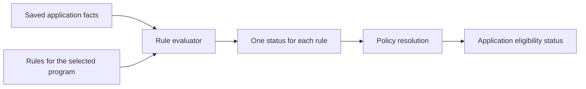
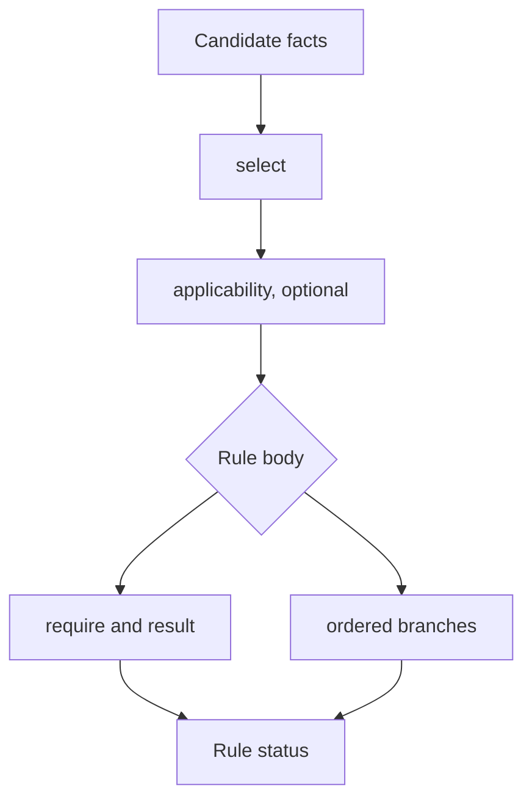
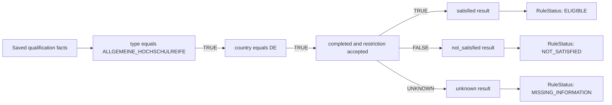
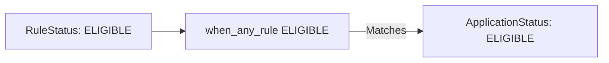
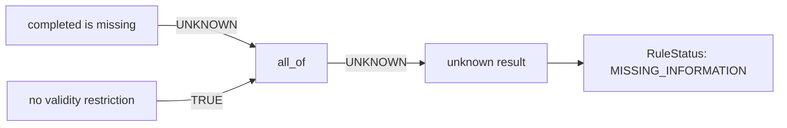
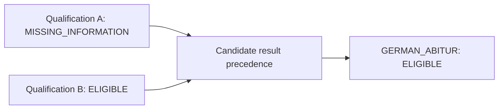
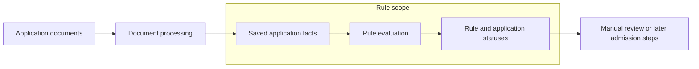

# Admission rules

## 1. Role of rules in the workflow

The rule evaluator receives saved application facts and the rules for the selected program. It evaluates each rule, records a status for each one, and then calculates the final application eligibility status.



The same facts and rule version always produce the same result. Reviewers can inspect the rules to understand why the evaluator returned a status.

An enum is a fixed list of allowed values. The code uses enums so rule names and statuses remain consistent in rule files, tests, and application results.

### 1.1 Rule IDs

A `RuleId` gives each rule a stable and unique name. The evaluator uses the ID to connect a rule definition with its result in the application result.

### 1.2 Rule statuses

Each evaluated rule returns one `RuleStatus`.

| Status                   | Meaning                                                               |
| ------------------------ | --------------------------------------------------------------------- |
| `ELIGIBLE`               | The applicant satisfies the rule                                      |
| `CONDITIONALLY_ELIGIBLE` | The applicant satisfies the rule with a stated condition              |
| `NOT_SATISFIED`          | The available facts show that the applicant does not satisfy the rule |
| `MISSING_INFORMATION`    | Required information is missing or unclear                            |
| `MANUAL_REVIEW`          | A person must review the case                                         |
| `NOT_APPLICABLE`         | The rule does not apply to the applicant                              |

### 1.3 Application status and resolution

The evaluator checks the resolution conditions in order. The first matching condition sets the final `ApplicationStatus`.

| Order | Resolution condition                     | Application status       |
| ----- | ---------------------------------------- | ------------------------ |
| 1     | Any rule is `ELIGIBLE`                   | `ELIGIBLE`               |
| 2     | Any rule is `CONDITIONALLY_ELIGIBLE`     | `CONDITIONALLY_ELIGIBLE` |
| 3     | Any rule requires `MANUAL_REVIEW`        | `MANUAL_REVIEW`          |
| 4     | Any rule has `MISSING_INFORMATION`       | `MISSING_INFORMATION`    |
| 5     | All applicable rules are `NOT_SATISFIED` | `INELIGIBLE`             |
| 6     | No rule recognizes the application facts | `MANUAL_REVIEW`          |

Each program policy can define its own resolution order. The order is important because an earlier matching condition takes priority over later conditions.

## 2. DSL constructs

The rule DSL is the set of YAML fields understood by the rule evaluator. YAML provides the file format, while the DSL defines what each field means.

Every rule file starts with a DSL version.

```yaml
dsl_version: "1.3"
```

### 2.1 Policies, modules, and references

A policy is the entry point for one program. It imports rule groups, evaluates their rules, and resolves the final application status.

A module contains definitions that a policy can reuse.

| Construct             | Purpose                                         |
| --------------------- | ----------------------------------------------- |
| `policy`              | Defines the rules and resolution for a program  |
| `module`              | Groups reusable definitions                     |
| `imports`             | Loads another rule file under a namespace       |
| `exports`             | Lists definitions that other files can use      |
| `requires_namespaces` | Lists namespaces that another file must provide |
| `ref`                 | Uses an exported definition                     |
| `include`             | Adds an exported rule group to a policy         |

```yaml
imports:
  - namespace: requirements
    file: common/requirements.yaml
```

A reference uses the namespace followed by the exported name.

```yaml
ref: requirements.completed_school_qualification
```

### 2.2 Expressions

An expression checks one or more saved facts.

```yaml
fact: qualification.completed
eq: true
```

| Construct | Meaning                                        |
| --------- | ---------------------------------------------- |
| `eq`      | The fact equals a value                        |
| `in`      | The fact is one of the listed values           |
| `gte`     | The number is equal to or greater than a value |
| `lt`      | The number is less than a value                |
| `all_of`  | Every expression must be true                  |
| `any_of`  | At least one expression must be true           |
| `ref`     | Use an exported expression                     |

An expression can return `TRUE`, `FALSE`, or `UNKNOWN`. It returns `UNKNOWN` when a required fact is missing, unreadable, or conflicting.

### 2.3 Rule structure

Each rule selects candidates and then evaluates them.



`select` chooses candidates from a fact collection. Its `where` expression identifies the qualification or professional access candidate that the rule can evaluate.

`applicability` is optional. It checks whether a selected candidate belongs within the legal or policy scope of the rule.

A rule then uses one of two body forms.

| Body                   | Use                                                                  |
| ---------------------- | -------------------------------------------------------------------- |
| `require` and `result` | The rule checks one requirement and handles true, false, and unknown |
| `branches`             | The rule checks several possible outcomes in order                   |

### 2.4 Results and fallbacks

Every result contains a status and a reason code. A conditional result can also contain a condition.

```yaml
result:
  status:
    ref: rule_statuses.ELIGIBLE
  reason_code: GERMAN_ABITUR_DIRECT_ACCESS
```

A requirement has three results.

| Requirement result | Selected output |
| ------------------ | --------------- |
| `TRUE`             | `satisfied`     |
| `FALSE`            | `not_satisfied` |
| `UNKNOWN`          | `unknown`       |

A branch group checks `first_match` entries in order.

| Branch evaluation                  | Selected output           |
| ---------------------------------- | ------------------------- |
| A `when` expression is `TRUE`      | The result of that branch |
| A `when` expression is `UNKNOWN`   | `unknown`                 |
| Every `when` expression is `FALSE` | `otherwise`               |

### 2.5 Application resolution

The policy resolves all rule statuses into one application status. Resolution cases are checked in order.

| Construct                   | Meaning                                        |
| --------------------------- | ---------------------------------------------- |
| `when_any_rule`             | At least one rule has the given status         |
| `when_all_applicable_rules` | Every applicable rule has the given status     |
| `when_no_recognized_rule`   | Every configured rule is not applicable        |
| `application_status`        | The final status returned by the matching case |

## 3. How evaluation works

The following example uses the real `GERMAN_ABITUR` rule from `school-access-rules.yaml`. The module and import wrappers are omitted so the evaluation is easy to follow.

### 3.1 Saved facts

The evaluator receives facts that were saved during document processing.

| Fact                                         | State   | Value                       |
| -------------------------------------------- | ------- | --------------------------- |
| `qualification.type`                         | `KNOWN` | `ALLGEMEINE_HOCHSCHULREIFE` |
| `qualification.country`                      | `KNOWN` | `DE`                        |
| `qualification.completed`                    | `KNOWN` | `true`                      |
| `qualification.validity_restriction_present` | `KNOWN` | `false`                     |
| `qualification.validity_restriction_code`    | `KNOWN` | `OTHER`                     |

`KNOWN` means the evaluator can use the value. A fact can also be missing, unreadable, or conflicting.

### 3.2 Rule definition

```yaml
- id: GERMAN_ABITUR

  select:
    from: school_qualifications
    as: qualification
    where:
      fact: qualification.type
      eq: ALLGEMEINE_HOCHSCHULREIFE

  applicability:
    require:
      ref: requirements.german_qualification
    result:
      not_applicable:
        status:
          ref: rule_statuses.NOT_APPLICABLE
        reason_code: ABITUR_NOT_GERMAN
      unknown:
        status:
          ref: rule_statuses.MISSING_INFORMATION
        reason_code: ABITUR_COUNTRY_UNKNOWN

  require:
    all_of:
      - ref: requirements.completed_school_qualification
      - ref: requirements.validity_restriction_accepted

  result:
    satisfied:
      status:
        ref: rule_statuses.ELIGIBLE
      reason_code: GERMAN_ABITUR_DIRECT_ACCESS

    not_satisfied:
      status:
        ref: rule_statuses.NOT_SATISFIED
      reason_code: GERMAN_ABITUR_REQUIREMENTS_NOT_MET

    unknown:
      status:
        ref: rule_statuses.MISSING_INFORMATION
      reason_code: GERMAN_ABITUR_EVIDENCE_INCOMPLETE
```

First, `id` gives the rule a stable name.

Second, `select` reads candidates from `school_qualifications`. The name `qualification` is used to refer to the selected candidate inside the rule.

Third, `where` checks whether the qualification type equals `ALLGEMEINE_HOCHSCHULREIFE`. The saved value matches, so the evaluator selects the qualification.

Fourth, `applicability` checks whether the qualification country is `DE`. The saved country matches, so evaluation continues.

Fifth, `require` checks that the qualification is completed and that any territorial restriction is accepted. The qualification is completed and has no restriction, so the requirement returns `TRUE`.

Finally, the `satisfied` result returns the rule status `ELIGIBLE` and its reason code.



`UNKNOWN` means a required completion or restriction fact is missing, unreadable, or conflicting.

### 3.3 Final application status

The policy then checks its resolution cases.

```yaml
resolution:
  first_match:
    - when_any_rule:
        ref: rule_statuses.ELIGIBLE
      application_status:
        ref: application_statuses.ELIGIBLE
```

The rule returned `ELIGIBLE`, so `when_any_rule` matches. The final application status is therefore `ELIGIBLE`.



### 3.4 When a requirement returns unknown

A requirement returns `UNKNOWN` when it needs a fact that is missing, unreadable, or conflicting. The evaluator cannot safely treat the requirement as true or false.

The `GERMAN_ABITUR` rule combines two real shared requirements.

```yaml
require:
  all_of:
    - ref: requirements.completed_school_qualification
    - ref: requirements.validity_restriction_accepted
```

The referenced requirements are defined in `common/requirements.yaml`.

```yaml
completed_school_qualification:
  fact: qualification.completed
  eq: true

validity_restriction_accepted:
  any_of:
    - fact: qualification.validity_restriction_present
      eq: false
    - fact: qualification.validity_restriction_code
      in:
        - ALL_GERMAN_STATES
        - THURINGIA
        - ALL_STATES_EXCEPT_BAVARIA_AND_SAXONY
```

Assume `qualification.completed` is missing, while `qualification.validity_restriction_present` is known and equals `false`. The completion requirement is `UNKNOWN`, and the restriction requirement is `TRUE`. No expression in the outer `all_of` is false, so the main requirement returns `UNKNOWN`.



| Completion requirement | Restriction requirement | `all_of` result | Rule result           |
| ---------------------- | ----------------------- | --------------- | --------------------- |
| `TRUE`                 | `TRUE`                  | `TRUE`          | `ELIGIBLE`            |
| `UNKNOWN`              | `TRUE`                  | `UNKNOWN`       | `MISSING_INFORMATION` |
| `FALSE`                | `UNKNOWN`               | `FALSE`         | `NOT_SATISFIED`       |

The last case returns `FALSE` because one false expression is enough to make `all_of` false. An unknown restriction does not change an outcome that is already known.

### 3.5 Multiple matching candidates

A fact collection can contain several candidates that match the same rule. The evaluator checks each matching candidate, but the decision report contains one status for the rule.

The evaluator selects the highest candidate result using this order:

| Order | Candidate status         |
| ----- | ------------------------ |
| 1     | `ELIGIBLE`               |
| 2     | `CONDITIONALLY_ELIGIBLE` |
| 3     | `MANUAL_REVIEW`          |
| 4     | `MISSING_INFORMATION`    |
| 5     | `NOT_SATISFIED`          |
| 6     | `NOT_APPLICABLE`         |

For example, an application can contain two German Abitur qualifications.

| Candidate       | Evaluation result                                                          |
| --------------- | -------------------------------------------------------------------------- |
| Qualification A | Completion information is missing, so the result is `MISSING_INFORMATION`  |
| Qualification B | The qualification satisfies every requirement, so the result is `ELIGIBLE` |



The `GERMAN_ABITUR` rule returns `ELIGIBLE` because that status has higher precedence. If several candidates share the highest status, the report includes all of their candidate IDs.

Candidate precedence applies within one rule. Application resolution is a separate step that combines the statuses returned by different rules.

## 4. Rule file structure

The `rules/` directory contains policy files, rule modules, and shared definitions.

| File                             | Type                | Contents                                                                                                                      |
| -------------------------------- | ------------------- | ----------------------------------------------------------------------------------------------------------------------------- |
| `bachelors-access.yaml`          | Program policy      | Defines the current Bachelor policy, imported modules, included rule groups, policy sources, and final application resolution |
| `school-access-rules.yaml`       | Rule module         | Defines rules for school qualifications                                                                                       |
| `professional-access-rules.yaml` | Rule module         | Defines rules for advanced vocational qualifications and professional experience                                              |
| `rule-statuses.yaml`             | Shared definitions  | Defines the allowed statuses returned by individual rules                                                                     |
| `application-statuses.yaml`      | Shared definitions  | Defines the allowed final application statuses                                                                                |
| `common/requirements.yaml`       | Shared requirements | Defines reusable fact expressions used by several rules                                                                       |
| `common/conditions.yaml`         | Shared conditions   | Defines conditions attached to conditional results, such as a trial study or entrance examination                             |

Program policy files are the entry points. A future program can have its own policy file and import the rule modules and shared definitions it needs.

Rule modules contain the individual admission rules. Files under `common/` contain definitions that several rules or program policies can reuse.

## 5. Scope of the rules

The rule evaluator works only with saved application facts. Document processing happens before rule evaluation, while manual review and enrollment decisions happen afterward.



### 5.1 Inputs

The current DSL can select candidates from three fact collections.

| Fact collection                      | Contents                                             |
| ------------------------------------ | ---------------------------------------------------- |
| `school_qualifications`              | School qualifications and their access properties    |
| `advanced_vocational_qualifications` | Meister and other advanced vocational qualifications |
| `professional_access_candidates`     | Vocational training and professional experience      |

Each fact records whether its value is known, missing, unreadable, or conflicting. Rules use those saved states and values without changing them.

### 5.2 Outputs

The evaluator returns:

| Output             | Contents                                                                  |
| ------------------ | ------------------------------------------------------------------------- |
| Rule result        | Rule ID, status, reason code, relevant facts, evidence, and any condition |
| Application result | Final eligibility status selected by policy resolution                    |

The evaluator can return `MANUAL_REVIEW`, but it does not perform the review or record the reviewer's decision.

### 5.3 Current policy coverage

The current policy evaluates five admission rules.

| Rule ID                                        | Covered admission path                                                 |
| ---------------------------------------------- | ---------------------------------------------------------------------- |
| `GERMAN_ABITUR`                                | German general university entrance qualification                       |
| `FACHGEBUNDENE_HOCHSCHULREIFE`                 | Subject restricted university entrance qualification                   |
| `GERMAN_GENERAL_FACHHOCHSCHULREIFE`            | German general university of applied sciences entrance qualification   |
| `GERMAN_MEISTER_OR_ADVANCED_VOCATIONAL`        | Meister or another accepted advanced vocational qualification          |
| `GERMAN_TRAINING_PLUS_PROFESSIONAL_EXPERIENCE` | Recognized vocational training with sufficient professional experience |

### 5.4 Adding more programs

The file structure can contain more program policies. A new policy can reuse existing requirements, conditions, and rule modules when they have the same meaning.

The current code fixes the allowed rule IDs, candidate collections, expression operators, and statuses. A program that needs different values in any of those areas requires code and test changes as well as new YAML rules.
