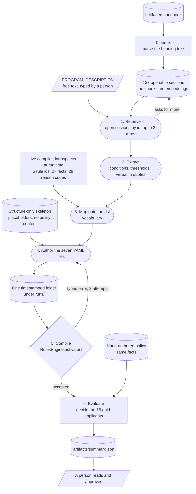

# Rule extractor

A prototype answering one question. Can a model pipeline re-derive compilable admission rules
from the IU handbook, so that writing rules for a new program is not the new bottleneck?

Nothing here is imported by the service. No generated rule ships without a person reading and
approving it, and the compiler rejects a broken package before it can screen anyone.

The one-line version. Read the handbook by its own structure, write down what it requires with
quotes, state honestly what the engine cannot express, author YAML against a blank skeleton, let
the real compiler reject it, then check it decides the same way as the rules a human wrote.

## Run

```console
uv run --with jupyter jupyter lab tools/rule-extractor/rule_extractor_demo.ipynb
```

Run the cells top to bottom. The key comes from the repository root `.env`, and
`ADMISSIONS_OPENAI_MODEL` sets the model. This spends tokens, about ten model calls and a few
minutes. Do not run it live in front of an audience; scroll the saved outputs instead.

The only input a person supplies is `PROGRAM_DESCRIPTION`, one free-text line naming the program,
in the cell above Stage 1.

Stage 6 reads the 16 saved gold applicants from `runs/` at the repository root. That directory is
gitignored, so on a fresh clone it is empty and the stage has nothing to score. Regenerate the
bundles with `admissions screen`, or point the stage at
`alternate-options/option-b-full-policy-workflow/baseline/`, which holds the same 16 applicants
under `application-result.json` rather than `decision-report.json`.

## How it works



Rounded boxes are model calls, rectangles are code, cylinders are files, and the two parallelograms
are the only places a person touches the pipeline: the program description going in, and the
approval coming out. The shapes carry the argument. The model proposes at every stage, and both
things that can stop a bad rule, the compiler at Stage 5 and the person at the end, sit outside it.

| Stage       | What happens                                                                                    | Writes                            |
| ----------- | ----------------------------------------------------------------------------------------------- | --------------------------------- |
| 0. Index    | Parse the `##`/`###` heading tree into 137 openable sections of 142 headings                    | the printed index                 |
| 1. Retrieve | The model sees only the index and the program description, opens sections by id, up to 3 turns  | `artifacts/navigation-trace.json` |
| 2. Extract  | Every admission route, with conditions, thresholds, outcome, blockers, and verbatim quotes      | `artifacts/requirements.json`     |
| 3. Map      | Each requirement against the engine's vocabulary: supported, or the extension it would need     | `artifacts/mapping.json`          |
| 4. Author   | YAML written against a structure-only skeleton, never against the hand-authored rules           | the seven rule files              |
| 5. Compile  | `RulesEngine.activate()`, the real compiler. On rejection the typed error goes back, 3 attempts | an activated engine               |
| 6. Evaluate | The compiled package decides the 16 gold applicants; compare against the hand-authored policy   | `artifacts/summary.json`          |

Then a person reads it. The compiler proves the package is well formed. Only a human can confirm
it is right.

Three details worth knowing.

**Stage 0 shares its inventory with options C and D.** It is ported from
[../../alternate-options/option-cd-agentic-rag/src/policy_index.py](../../alternate-options/option-cd-agentic-rag/src/policy_index.py),
so both experiments retrieve over the same substrate and the comparison between them is fair.
Spans are non-overlapping, a `###` carries its parent `##` chapter as a breadcrumb, and a `##`
that is nothing but its own heading line is dropped from the openable set. The one addition here
is a line count on each entry: the navigator has a 3-turn budget and without a size signal it
spends a turn opening all 24 per-programme subsections of `SPECIAL REQUIREMENTS IN BA DEGREE
PROGRAMS`.

**Stage 1 does no chunking and no embeddings.** The document's own structure is the retrieval
index, and the rationale behind every section it opens is recorded.

**Stage 3 introspects the compiler rather than hardcoding it.** The 5 rule ids, 3 candidate
collections, 27 candidate facts, and 29 reason codes are read from `_SOURCE_FACTS`,
`_APPLICATION_FACTS`, `RULE_ORDER`, and `RULE_EXPLANATIONS` at run time, so the mapping can never
drift from what the engine really supports.

## The artifacts

Every stage writes its intermediate to `artifacts/` inside the run folder. No stage is a black
box; each one produces a file a person can open and argue with.

| File                    | Written by | What it is for                                                                                 |
| ----------------------- | ---------- | ---------------------------------------------------------------------------------------------- |
| `navigation-trace.json` | Stage 1    | Why the model opened each section, its rationale per turn. The retrieval decision is auditable |
| `requirements.json`     | Stage 2    | What the handbook says, with verbatim quotes and section titles. Traceability back to source   |
| `mapping.json`          | Stage 3    | What the engine cannot express. The coverage gap, stated rather than hidden                    |
| `summary.json`          | Stage 6    | Compile result and the per-applicant decision table                                            |

`navigation-trace.json` has a second reader.
[../../alternate-options/option-cd-agentic-rag/src/config.py](../../alternate-options/option-cd-agentic-rag/src/config.py)
resolves the newest `generate-rules-*` run and scores options C and D's retrieval recall against
it. With no run on disk that section of `retrieval-quality.md` is skipped rather than failing.

### mapping.json

The engine's authoring surface is fixed in code. The handbook does not care about that. Stage 3
answers, for each requirement the handbook states, whether this engine can actually express it.

Six fields per requirement:

| Field                | Meaning                                            |
| -------------------- | -------------------------------------------------- |
| `requirement_id`     | Joins back to `requirements.json`                  |
| `supported`          | Can the fixed vocabulary express this              |
| `target_rule_id`     | Which of the five rules it would become            |
| `facts_used`         | Which engine facts it needs                        |
| `notes`              | The mapping reasoning                              |
| `unsupported_reason` | Precisely which engine extension would be required |

Why the stage exists at all: in admissions, silently dropping a policy requirement is the one
unacceptable failure. Without it the pipeline would quietly encode the routes it can handle and
say nothing about the rest. This file turns a silent gap into a reviewable list.

**What the current run reports: 0 of 36 supported.** That is not a broken mapper. 32 of the 36
reasons name specific missing facts and 9 name missing collections. Nineteen drag in
official-certification evidence the vocabulary has no room for. The extraction reached
state-specific routes the five-rule engine genuinely cannot express, such as Baden-Württemberg
Berufskolleg II, Waldorfschule Fachhochschulreife, and the Rheinland-Pfalz practical part, each
needing a dedicated rule plus ministry-confirmation facts.

**The tension to state out loud.** Stage 4's contract tells the generator that unsupported
requirements are out of scope and only supported ones should be encoded. The mapping said nothing
was supported. The generator worked from the requirement details and produced a compiling
five-rule package regardless. So today this file is descriptive rather than load-bearing: a good
gap report, but not a gate. Making it a gate needs a third verdict, `partially_supported`, that
separates a route's encodable core from its unencodable rider.

## What is here

| Path                        | What it is                                         |
| --------------------------- | -------------------------------------------------- |
| `rule_extractor_demo.ipynb` | The pipeline, end to end, one code path            |
| `generated-rules-master-c/` | The kept Master package, the negative result below |

Nothing this notebook produces is committed. Every run writes into its own timestamped folder
under `runs/`, described in the next section.

## Where the Bachelor rules land

One timestamped folder per run, under `runs/` at the repository root:

```
runs/generate-rules-20260827-141530/
├── bachelors-access.yaml           the policy entry file, authored
├── school-access-rules.yaml        rule module, authored
├── professional-access-rules.yaml  rule module, authored
├── common/requirements.yaml        shared expressions, authored
├── common/conditions.yaml          shared conditions, authored
├── rule-statuses.yaml              scaffold, copied in verbatim
├── application-statuses.yaml       scaffold, copied in verbatim
└── artifacts/                      the four stage intermediates
```

The folder name is printed by the first cell and again by the config cell. A run never overwrites
an earlier one, so a navigation trace can always be matched to the package it produced. `runs/` is
gitignored, so none of it is committed.

The compiler globs `*.yaml` at the top level only, which is why `artifacts/` can sit alongside the
rules without confusing it. Compare the package against the hand-authored one in
[../../rules/](../../rules/).

## One code path, by design

Earlier runs measured three prompting arms. Two were cut and the arm machinery was removed, so
the notebook now has a single path. The findings cell at the bottom carries the current numbers.

| Arm | Prompt extras                       | Why it went                                                                                                                                                                            |
| --- | ----------------------------------- | -------------------------------------------------------------------------------------------------------------------------------------------------------------------------------------- |
| A   | the DSL spec only                   | Never compiled in any run. It guessed the file envelope wrong, and `INVALID_POLICY_SCHEMA` is too opaque for the repair loop to steer by                                               |
| B   | spec plus the hand-authored YAML    | Reproduced the reference near-verbatim every run. Its perfect score measured copying, not derivation                                                                                   |
| C   | spec plus a structure-only skeleton | **Kept, and is now the only path.** The skeleton shows every envelope field as a `<placeholder>` with zero policy content, so it fixes A's failure without handing over the answer key |

What remains is the only configuration that can support a genuine claim of deriving rules from
the handbook.

Honesty note: `rules/README.md`, the DSL spec the generator must see, embeds the hand-authored
`GERMAN_ABITUR` rule as its worked example. The other four rules, the shared requirements, and the
policy resolution are still derived from the handbook.

## The Master run, a useful negative result

The same pipeline was pointed at the M.Sc. program once. The engine cannot compile Master rules,
because `study_level` is fixed to `BACHELOR` and the rule IDs are Bachelor IDs. The model proposed
new vocabulary and the compile step recorded the rejection rather than repairing it. That is the
design working: an unencodable rule becomes `MANUAL_REVIEW` rather than a guess.

The proposed package is kept. The one-off script that produced it is not part of the current
notebook; to reproduce the result, point `PROGRAM_DESCRIPTION` at the M.Sc. program and set
`COMPILE_AND_EVALUATE = False`, which authors the package for human review and records the
compiler's rejection instead of repairing it.

```console
ls tools/rule-extractor/generated-rules-master-c/
head -30 tools/rule-extractor/generated-rules-master-c/masters-access.yaml
```

The reasoning is in [../../docs/technical-design-document.md](../../docs/technical-design-document.md) under D5.
